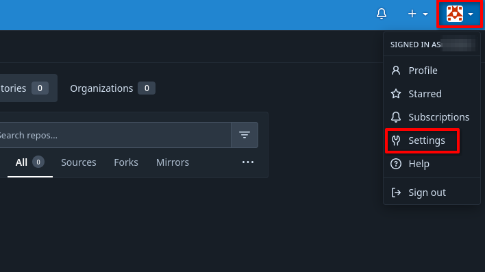
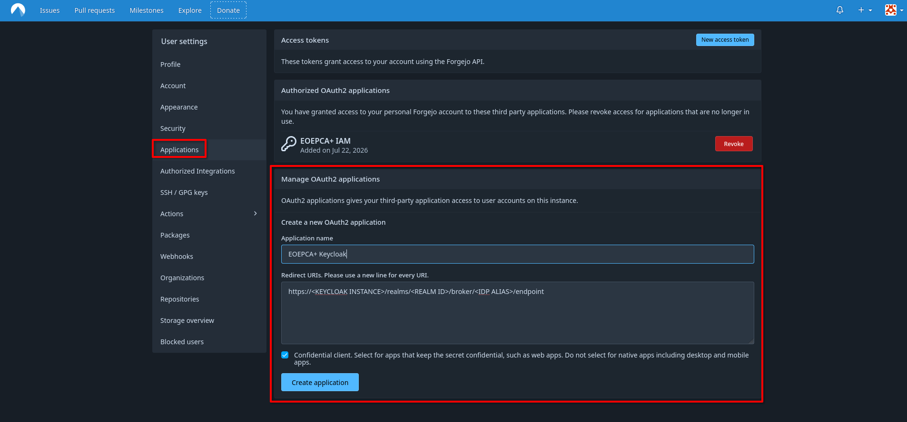
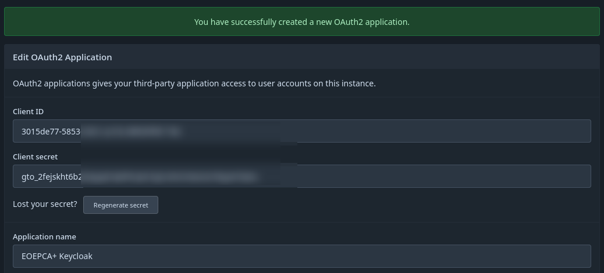
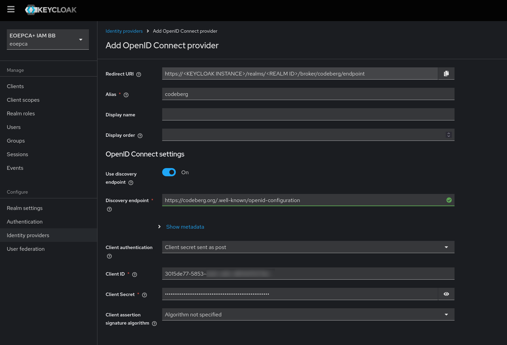

# Codeberg as IDP in Keycloak

To make it possible for users to login with their Codeberg account, you should firstly setup the connection on Codeberg's side.

You will receive credentials, which are required in the Keycloak configuration.

## Codeberg Configuration

For the registration of your Keycloak instance at Codeberg, you firstly need a Codeberg Account, which should hold the configuration.

After logging in into your desired Codeberg Account, please visit the OAuth Apps by clicking [here](https://codeberg.org/user/settings/applications) or navigate manually:

- Click on your profile picture on the top right.
- In the menu, click on `Settings`

- On the left sidebar, click on `Applications`.

Arrived at the Applications Page, you can now see `Manage OAuth2 applications`.
On this form, you will have to enter a name, which you can custom choose (it will be used as display name at Codeberg) and the Redirect URI from Keycloak.

**Important is the `Redirect URI`, which you can extract from the Creation process of the IDP in Keycloak (see [Keycloak Configuration](#keycloak-configuration)).** If it doesn't match, Codeberg will propably throw an error while clicking on the Codeberg Login in Keycloak.

After creation, you are now able to obtain the Client ID and Client Secret for integration in the Keycloak Configuration!

## Keycloak Configuration

Inside of keycloak, you need to configure a new IDP which represents the Codeberg instance. 

As Keycloak doesn't support Codeberg as own Provider at this time, you need to use `OpenID Connect`. Also see [Setup other IDP](setup-other-idp.md).

At first, you will encounter a `Redirect URI`. This is useful for configuring the application in Codeberg. It is read-only.

For Codeberg, you need to set the Alias (which has effect on the Redirect URI), the Discovery Endpoint and the Client-ID and Secret which can be obtained from the Codeberg settings page above.

The Discovery Endpoint is found in the [Codeberg Documentation](https://docs.codeberg.org/integrations/keycloak/), at the time of writing it is `https://codeberg.org/.well-known/openid-configuration`.
From this URL, Keycloak should fetch the URLs it needs. If it doesn't work, you can also copy and paste the URLs manually.

