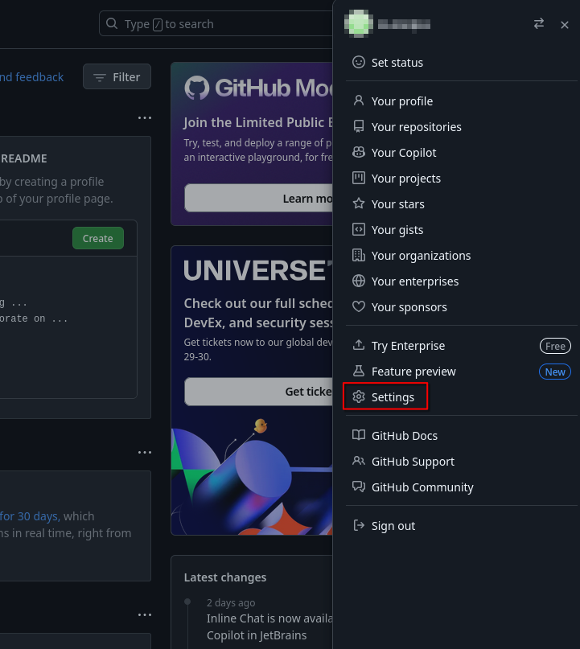
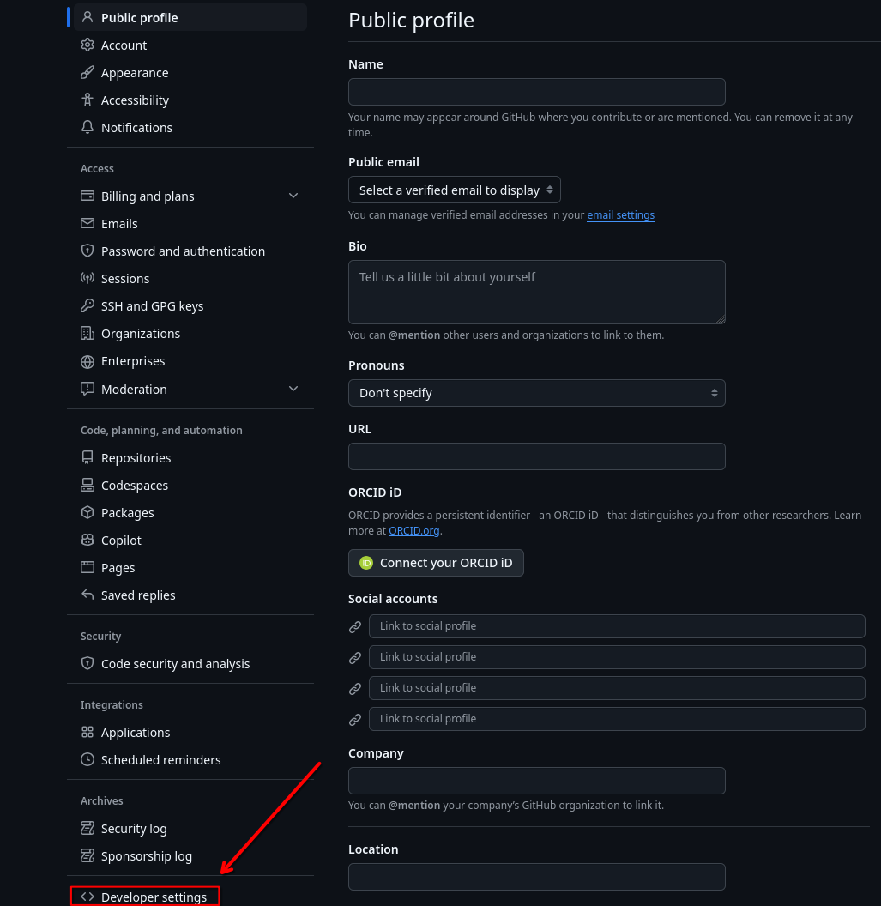
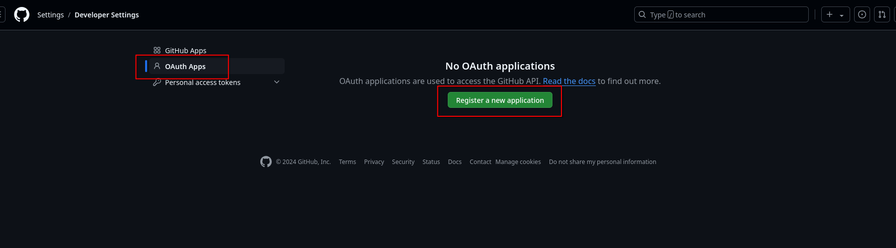
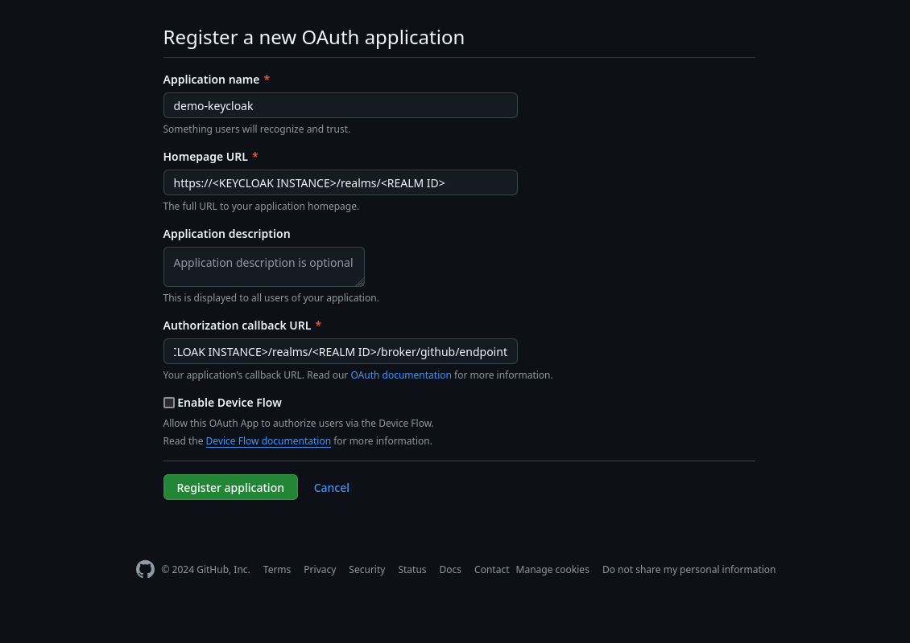
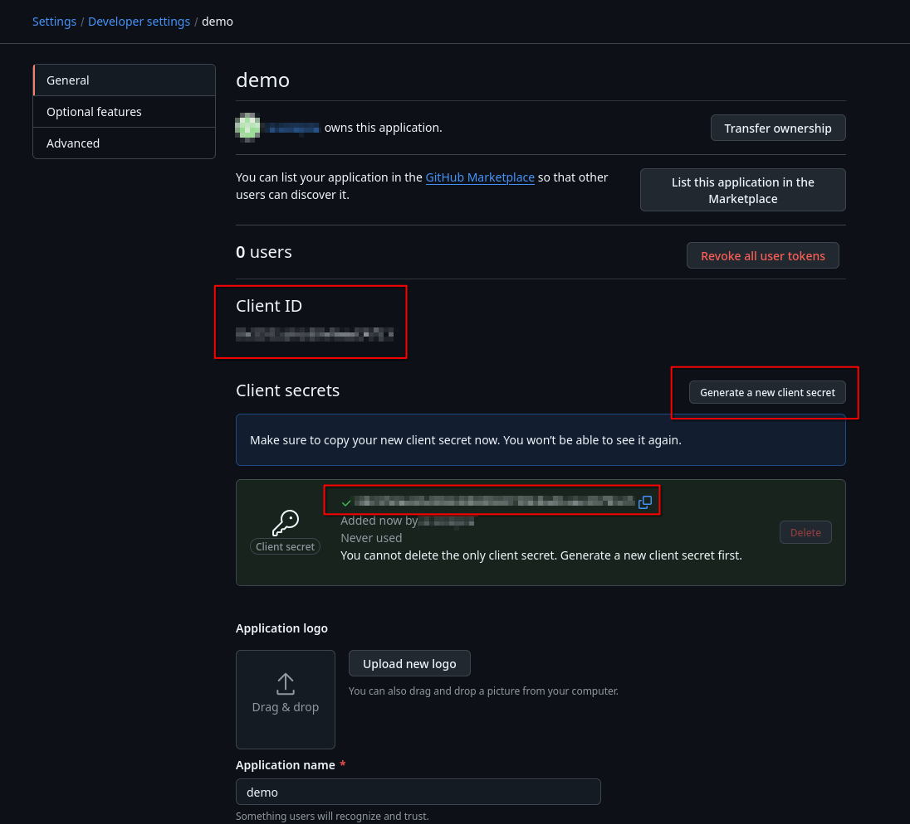
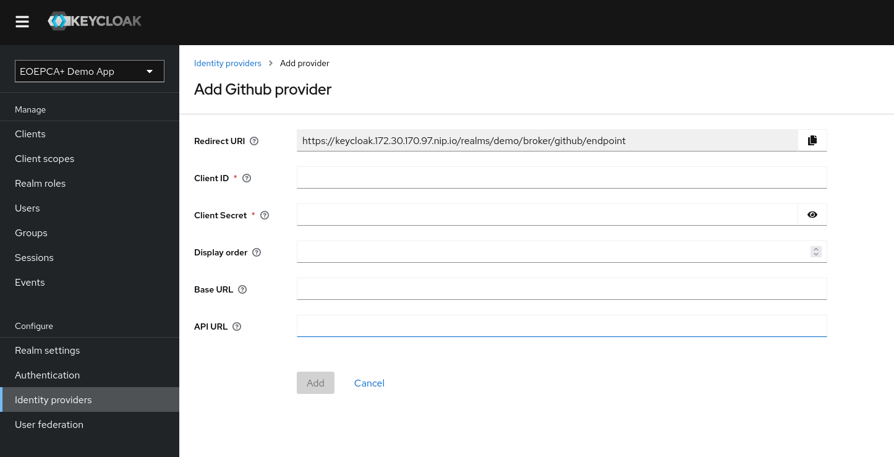

# GitHub as IDP in Keycloak

To make it possible for users to login with their GitHub account, you should firstly setup the connection on GitHub's side.\
You will receive credentials, which are required in the Keycloak configuration.

## GitHub Configuration

For the registration of your Keycloak instance at GitHub, you firstly need a GitHub Account, which should hold the configuration.

After logging in into your desired GitHub Account, please visit the OAuth Apps by clicking [here](https://github.com/settings/developers) or navigate manually:
- Click on your profile picture on the top right.
- In the menu, click on `Settings`\

- On the left sidebar, click on `Developer settings`.\

- Now, please click on `OAuth Apps`.

Arrived at the OAuth Apps Page, you can now `Register a new application`.

On the form appearing, you will have to enter two URLs from your keycloak instance:

The `Homepage URL` will be used from GitHub for internal purposes. **Important is the `Authorization callback URL`, which you can also extract from the Creation process of the IDP in Keycloak (see [Keycloak Configuration](#keycloak-configuration)).**

After creation, lastly you need to `Generate a new client secret` on the appearing settings page of your application.\
You can now obtain the Client ID and Client Secret for integration in the Keycloak Configuration!

## Keycloak Configuration

Inside of keycloak, you need to configure a new IDP which represents the GitHub instance. Also see [Setup other IDP](setup-other-idp.md).

At first, you will encounter a `Redirect URI`. This is useful for configuring the application in GitHub. It is read-only.

For GitHub, you only need to set a Client ID and Secret. This credentials are provided by the GitHub configuration above.\
By default, the https://github.com/ instance will be used by keycloak. If that is not suitable for your environment, you can use a different URL by setting a "Base URL".

