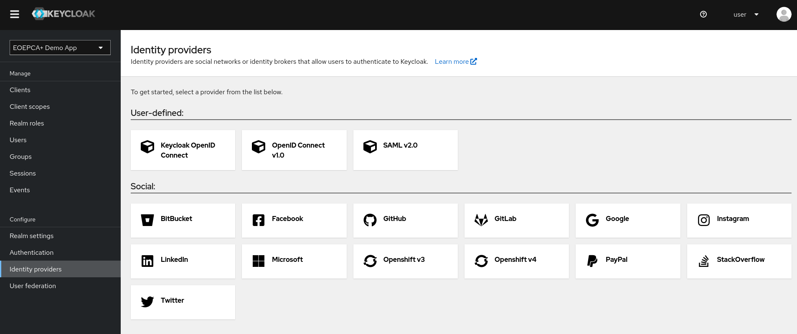
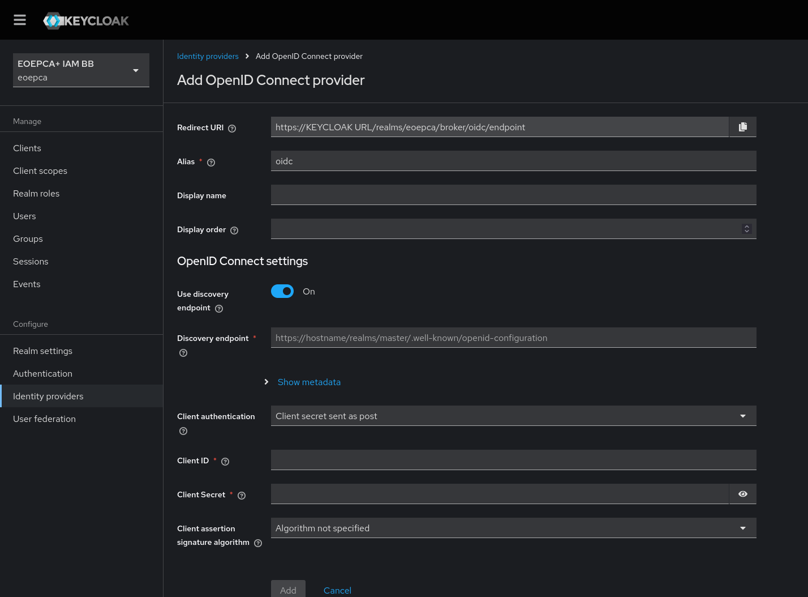
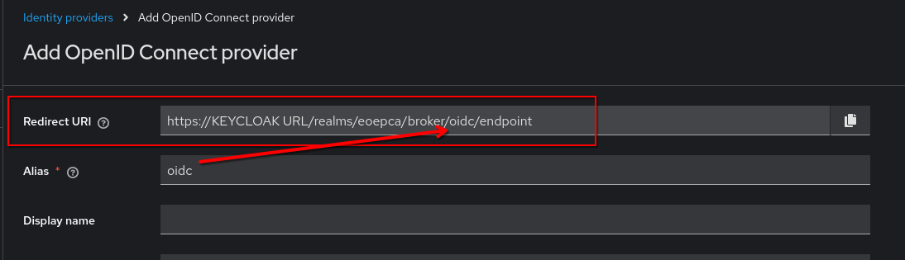
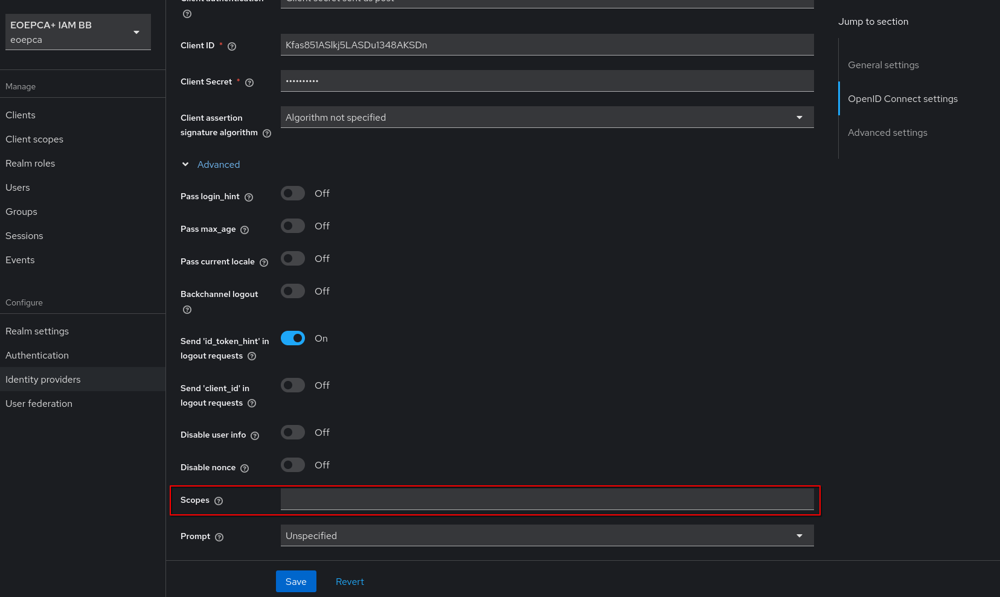
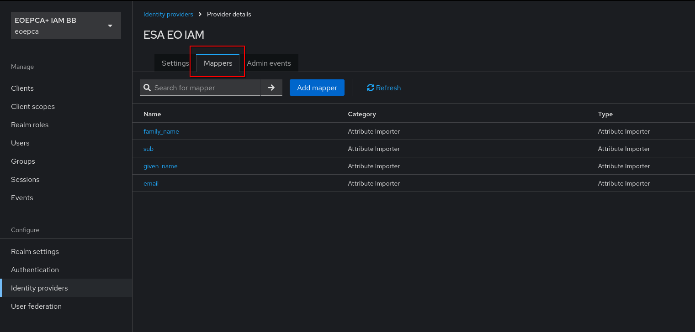
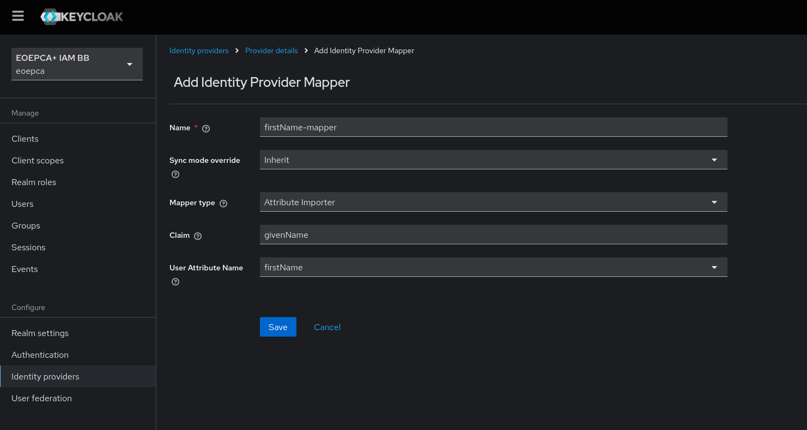

# Setup IDPs in Keycloak

Inside a Realm, you can offer users to login into the realm by using an external account (from an Identity Provider).

Keycloak supports many Identity Providers by default, see below:

The Configuration of Identity Providers is straight-forward for these already supported providers, many times you only need to register an application at the Identity Provider to get Client Credentials, which you have to enter inside the Keycloak IDP Configuration to authorize at the Identity Provider.
For an example, please see the [Integration of GitHub](github-setup-idp.md).

## Setting up non-supported IDPs (for example EOIAM)

Non-supported IDPs can be configured under the "**User-defined**" options. There are different protocols you can use to setup the communication between you and the Identity Provider.

The most common one is currently OpenID Connect/OAuth2, you will find this protocol supported at most of the Identity Providers, for example EOIAM.

You can add such custom IdP with the help of the "**Add Keycloak OpenID Connect provider**" form/option.

### Exchanging the required information with the IdP

To setup the IdP, you need to get in touch with the Identity Provider so they can create credentials for your application in their IdP software.
Most likely they want the following informations from you:
- `Name of application / Client Name / ...`: This can be freely decided by you.
- `Redirect URL`: This URL can be obtained from the "Redirect URI" field in the Form. Please keep in mind that part of this URL can dynamically change while changing the field "Alias". 
- `Flow`: When redirecting your users from Keycloak to the Identity Provider you most likely want the "Authorization Code" Flow. This flow happens in the browser of the user.
- `Attributes / Claims / Scopes`: You can freely decide which User attributes you want to receive from the Identity Provider. If the Identity Provider can provide you those attributes, you can create a mapping for the received attributes to your keycloak accounts in a later step.

After providing this information to the IdP, the IdP should be able to give you the credentials and information you need to fill in the "Add Keycloak OpenID Connect provider" form.
Mainly this will be:
- `Discovery endpoint`: You will find all URLs you need for the OpenID Connect connection in it. Keycloak just wants the Discovery URL and will try to obtain all URLs by itself. You can review or edit the needed URLs by Keycloak by clicking on "**Show metadata**" below the Discovery Endpoint field inside the form.
- `Client ID`: This can be freely decided by the IdP in most situations. Keycloak will provide this Client ID in further requests to the IdP so the IdP knows who you are. It is also possible that the IdP will use your name of application or any other name you provided.
- Client authentication required? 
  - If yes, details about a `Client Secret` (=password)
- `Scopes`: Possibly the IdP wants you to request a special scope to receive your wanted attributes/claims. You can fill this information in at a later step (creating the mappings).
- `Claims`: Possibly the IdP will also provide you the name of the Claims/attributes you wanted, so you can map those attributes' names to your local keycloak attributes. You will need this information while creating the mappings.

With this information you should be able to initially create the IdP in Keycloak.

### Creating Claim Mappings

If you want to edit the IdP in Keycloak, you will see much more information to edit than in the creation process.

To receive Claims, possibly the IdP wants you to request a special scope. You can configure it under the **"Advanced" section**.

By default, the `scopes` Field is set to "openid". To add for example the scope "test", you will need to enter "openid test".

Now you should be able to create Claim Mappers. For this, please visit the **"Mappers" tab** at the top of the settings.

In this tab you can simply create a new mapping. Inside the Mapping Creation Form, you will need to select a `Mapper type`.

To map external attributes to internal keycloak attributes, you need to use the `Attribute Importer`. But you can also use the other mappings if you want a more advanced mapping to roles etc.

Keycloak will ask you for `Claim` and `User Attribute Name`. `Claim` is the Claim Name provided by your IdP. `User Attribute Name` is the name of your attribute in Keycloak.

When created and if the IdP sends out a Claim with the specified name, Keycloak should now map this Claim/Attribute to the local Keycloak User Attribute!