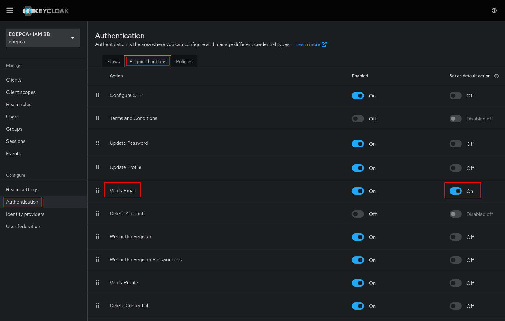
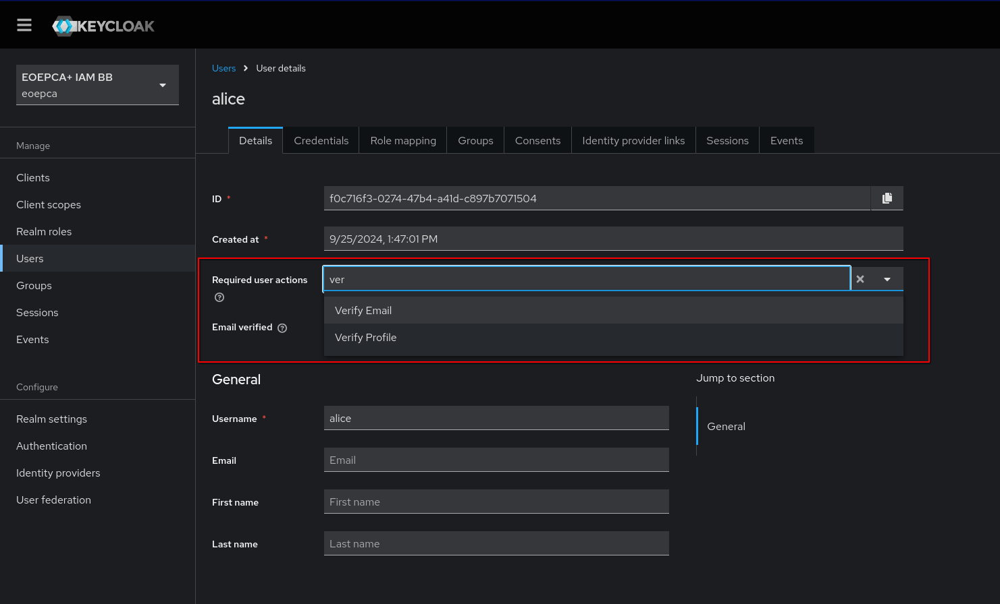
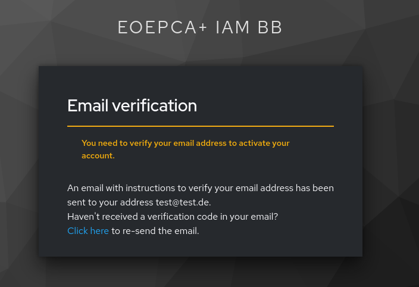
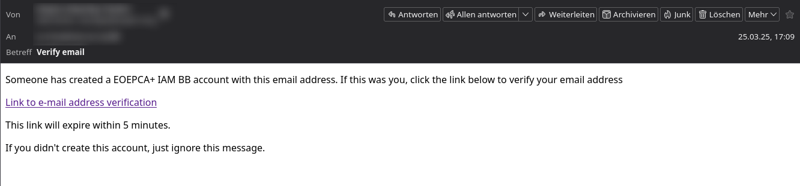
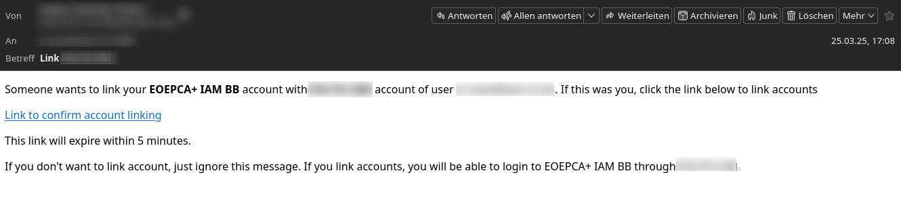

# Verification with email address

## Configure Account Creation Verification

To configure the verification of email address from newly created users, you need to change the following settings inside a realm configuration:

`Authentication (sidebar) > Required actions (tab) > Set "Verify Email" as default action`

After enabling this setting, new users will get the action "Verify Email" **automatically** assigned to them.
You can also assign this action **manually** to specific users by opening their user settings page and adding the required action "Verify Email".

After the user verified himself, the action gets removed and **the user parameter "Email verified" is enabled**.

### How users verify themselves

When a user has the keycloak action "Verify Email" set, he will be prompted after login with an informational text which explains that he will receive an email to verify his account email address.

The user will receive an email with a **clickable link**:

This email is editable via keycloak themes.

After clicking the link, **keycloak verifies the user internally** and the login flow **continues**, e.g. redirecting to the registered service/client.

## Configure IdP Account Link Verification

The IdP Link Email Verification is one (and the default) option of two. 
The goal is to verify, that the automatically found keycloak account really belongs to the person which tried to login with the same email address over a second IdP.

**At the moment, it is enabled by default and keycloak doesn't support to deactivate this functionality.**

It is only possible to deactivate this functionally by removing the email settings. If no email settings are configured in the realm, the user will by default be prompted to login in their existing keycloak account.

The user will receive the following email to verify the IdP Account Link, which is also editable via keycloak themes:

