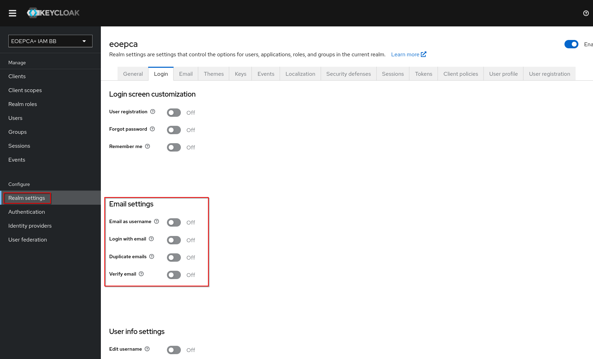
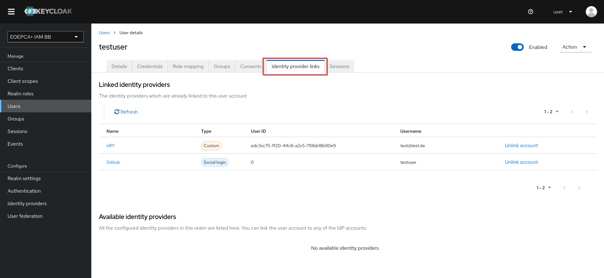
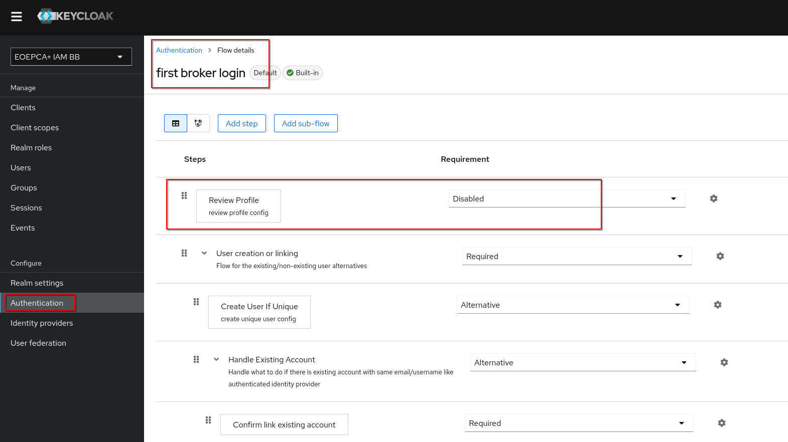
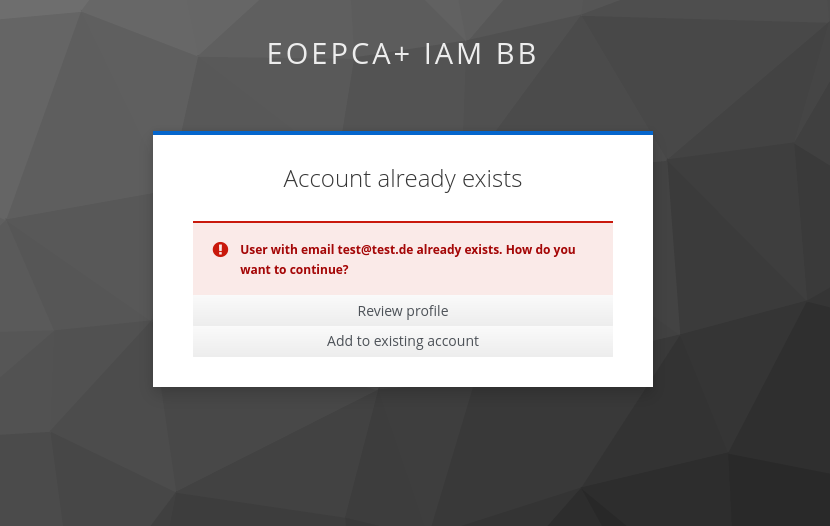
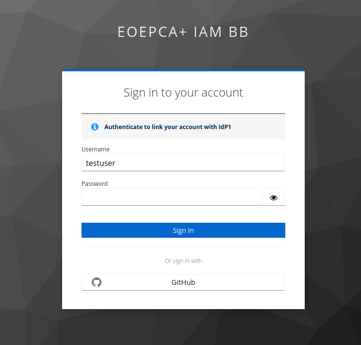
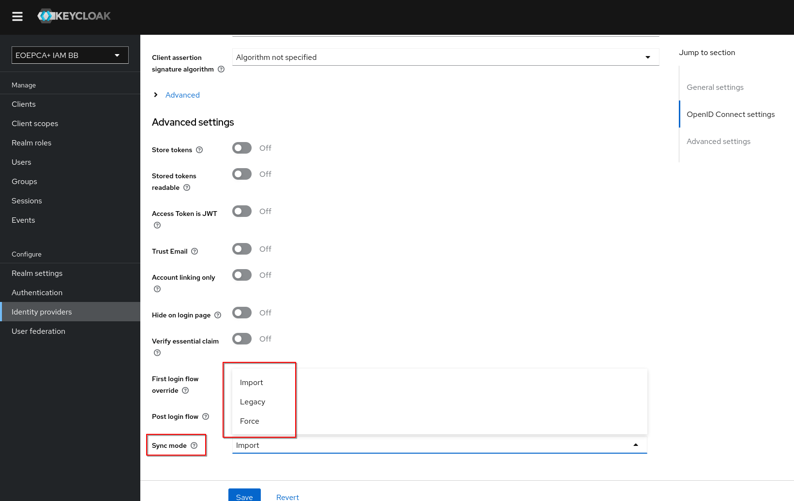

# Identity Mapping in Keycloak

This guide explains how to ensure that one identity in Keycloak is generated and used for login with multiple external identity providers.

## Configure Keycloak

Keycloak ensures that identities are not doubled **by default**. 
It does that by ensuring the username and the email-addresses are not already taken.

In the settings of a Realm, under the tab "Login", you can configure the default behaviour of Keycloak.

The **email address** is a good way to identify the same user across multiple identity providers. 
To ensure that Keycloak only uses one identity for the same person, the "Duplicate emails" setting should be turned off.

Keycloak should then try to link accounts with the same email address automatically.
Linked identity providers can be seen in the Details page of a user under the tab "Identity provider links".

During the linking process, the user can review and edit the profile information from their identity provider before keycloak processes them. **Depending on the use-case this could be a problem due to the lower trust in the received profile information.**

To deactivate the functionality of the "Review Profile" Button, set Authentication > first broker login > Review Profile requirement to Disabled.

## Linking Identity Providers with an existing Keycloak account as user

After trying to sign in with an external identity provider at Keycloak, which has the same email address for the identity configured as an existing keycloak account, keycloak will greet the user with an prompt to link their identity from the second provider with their existing keycloak account.
**This will also work with an existing Keycloak account which got created through a first identity provider**.

If not blocked, it is also possible for users to review and edit the profile informations from their identity provider before keycloak processes the data further.

After confirming the Identity linking, keycloak will ensure that the detected existing Keycloak account really belongs to the user.
This is done by either sending an email with a **verification link** to the existing Keycloak account or by prompting the user to **login in their existing Keycloak account** in the browser.

If the user confirmed that the existing Keycloak account belongs to them, **the linking process is done** and the user will be redirected to back to their service which they wanted to login to.

## Ensuring Keycloak accounts have the latest attributes from their identity providers

Keycloak supports updating the user after every login through an identity provider with their **latest external profile**.

This setting can be changed per identity provider. You can find it in the Edit-Mode of an identity provider under the setting "Sync mode".

While Sync mode "Force" updates the user **after every login** at the IdP, the mode "Import" only does a **first import of the external profile during the creation process of a keycloak account**.

**Please note that the username could also change in "Force" mode, depending on the IdP Attribute Mapping Configuration. It is possible, that the keycloak username changes while logging in with different identity providers.** It is recommended, that Clients connected to Keycloak use the email attribute as unique identifier for users.