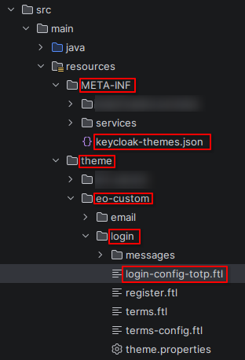
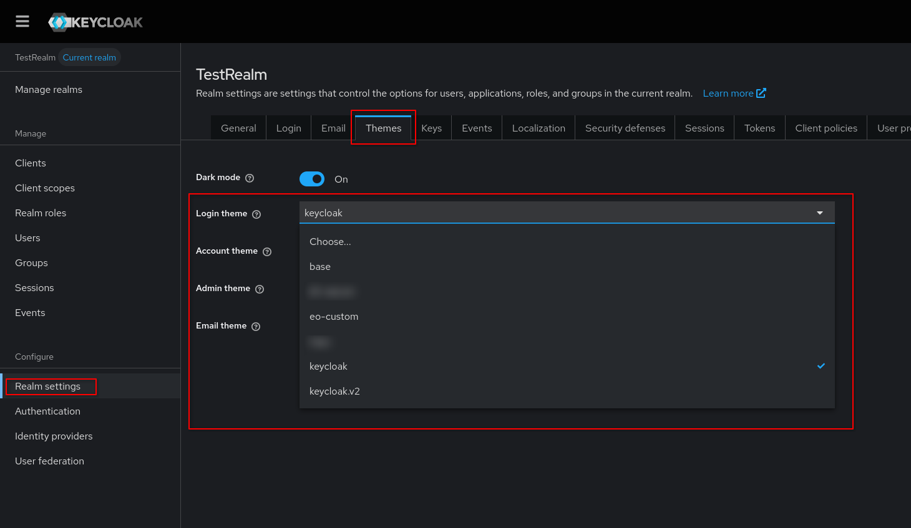

# Change Keycloak Branding

If you don't like the default keycloak design or want to add own logos to login forms or email texts, you might want to edit the default Keycloak branding.
This is possible by **creating your own theme** for Keycloak.

## Finding the correct branding files
You can include own branding into keycloak sites via editing the associated ``.ftl``-files inside Keycloak. To find such files, the easiest way is to look into the **keycloak project default themes**: https://github.com/keycloak/keycloak.

For example, if you want to edit the **user device flow code page**, it might be this one: https://github.com/keycloak/keycloak/blob/main/themes/src/main/resources/theme/base/login/login-oauth2-device-verify-user-code.ftl

## Applying new branding files to Keycloak
To edit ``.ftl``-files, you need to create a Keycloak Theme.
When creating Keycloak Themes, you can import the base-Theme or keycloak.v2-Theme via ``theme.properties`` and then add your own ftl files under __the path where it should be replaced__. Keycloak will then replace the original ``.ftl``-files with the new ones.

Themes can be deployed to Keycloak via the ``theme`` directory or via an **Keycloak Extension** build as ``.jar``, placed in the ``/providers`` directory.

It is recommended to put the created theme files or the extension into the directory via mounting them into the Keycloak Container.
The ``theme`` and ``providers`` directory is currently found inside the default keycloak container under path ``/opt/keycloak``.

**The basics of creating and deploying Keycloak themes and Examples are also described in the keycloak documentation here:** https://www.keycloak.org/ui-customization/themes

A theme deployed as Keycloak extension should look like this:

The red marked folders and files are minimum required to edit for example ``login-config-totp.ftl``.

### Activating a Custom Theme

After successful deployment, **the theme needs to be activated** by selecting it in the realm it should be used in.

To do this, visit the Administration UI of Keycloak and select the realm you want to apply the theme to. Then navigate to "Realm settings" > "Themes". If deployment is correct, you should find your custom theme under the right theme type selectable here.

## Upgrading Keycloak with Custom Branding

When Keycloak gets upgraded, it is recommended to check if the edited ``.ftl``-files got changed within the new Keycloak version.
This can be done by reviewing the Keycloak Github Project, as mentioned above.

If it got changed, own custom changes should be **merged** with the changes from the new keycloak version.
If not, it should be possible to upgrade keycloak **without editing the deployment described above**, because the existing theme will get added to the new keycloak container.
