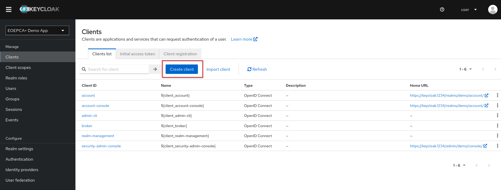
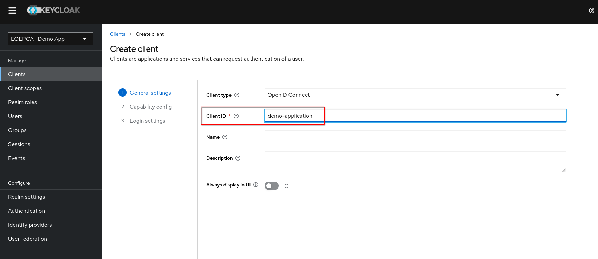
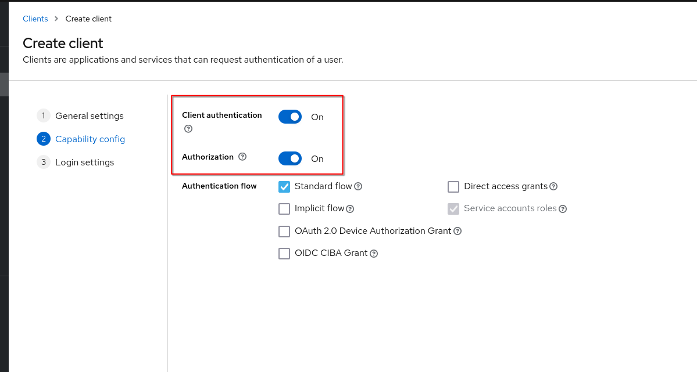
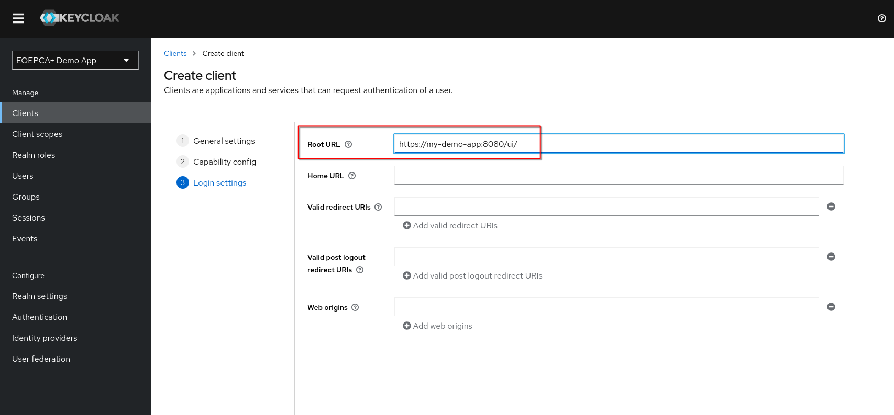

# Basic Realm Configuration

Every Keycloak Realm represents a "group" of users. These users can **authenticate** at clients configured in this realm.

For checking **Authorization** of a user (which would also be needed for the OPA plugin), it is required to [configure a client](#Configure_a_client) for each application that should connect with the Keycloak realm.

The "users" of a realm can be imported by various methods. They are seperated by "User federation" (for internal user accounts) and "Identity Providers" (for external user accounts).

## Link an IDP

For further information about integrating your first IdP please see [Setup IDPs in Keycloak](../idp/setup-other-idp.md)

## Configure a client 

To configure a client, visit the "Clients" Tab of the Realm.
For each application, which should be added to the Keycloak realm, you need to create a new client.

Every client needs a client id. You can type in what you want, this value will get important later while setting up your application to use Keycloak (see [Keycloak as IDP](../../usage/keycloak-as-idp.md))

Optionally, you can activate Client Authentication and Authorization. If Client Authentication is enabled, your application needs own credentials while doing requests to Keycloak. It will be a combination of client_id (your value set above) and a generated client_secret.

You can also allow other OpenID Connect Flows, for example a Machine-to-Machine Flow (e.g. Resource Owner Password Credentials Grant)
For further informations about the OpenID Connect Flows, please see the [OpenID specification](https://openid.net/specs/openid-connect-core-1_0.html#Authentication).

You also need to specify which application will use this client. This is done by defining the Root URL of the application which will use Keycloak.\
Only allowed redirect urls can request your created client.

Further information about the Keycloak clients can be found in the [Keycloak Documentation](https://www.keycloak.org/docs/latest/server_admin/index.html#assembly-managing-clients_server_administration_guide)