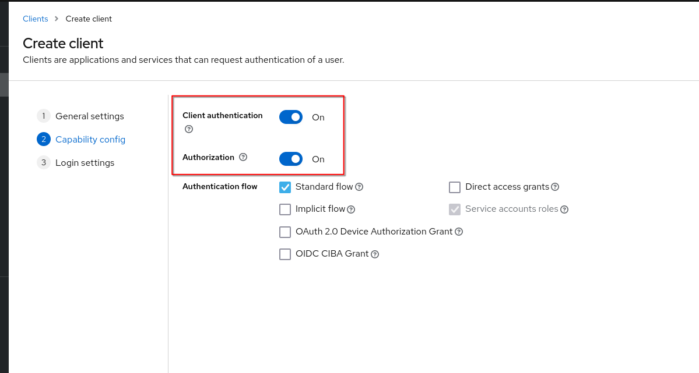

# Use OPA Polices for Authorization in Keycloak Clients

Following steps needs to be taken to start with enforcing OPA Policies in Keycloak Clients. Please note that this requires the OPA Connector Plugin installed in Keycloak.

## Prepare a Client for OPA Policies

To enable (OPA) Policy-Support for a Client, you need to enable "Authorization". To achieve that, Keycloak requires to also enable "Client authentication".\
You can achieve that by enabling these options at the client creation process, but also while editing an existing client.

Because of the enabled Client authentication, the application connected to Keycloak needs to authenticate with Client ID and Secret (or something else). The Client authentication can be configured in the "Credentials" Tab of a client configuration inside Keycloak.

## Configure your first OPA policy

The OPA policies can be configured in the "Authorization" Tab under "Policies" of a client configuration.

If using the Keycloak OPA Connector Plugin, after clicking on "Create client policy" there should be a new Policy-Type supported "Opa". After selecting it, the "Name" field currently is the path to the OPA Policy on the filesystem.

For additional information about the Keycloak OPA Policy Type, see the documentation of the [Keycloak OPA Connector Plugin](https://github.com/EOEPCA/keycloak-opa-plugin).

## Use the created OPA policy

For using created (OPA) policies, you need to create Resources and Permissions under the "Authorization" tab and assign them to the policy.

This is Keycloak default behaviour, so to see more information about this Keycloak Function please visit the documentation of the [Keycloak Authorization Services Guide](https://www.keycloak.org/docs/latest/authorization_services/)