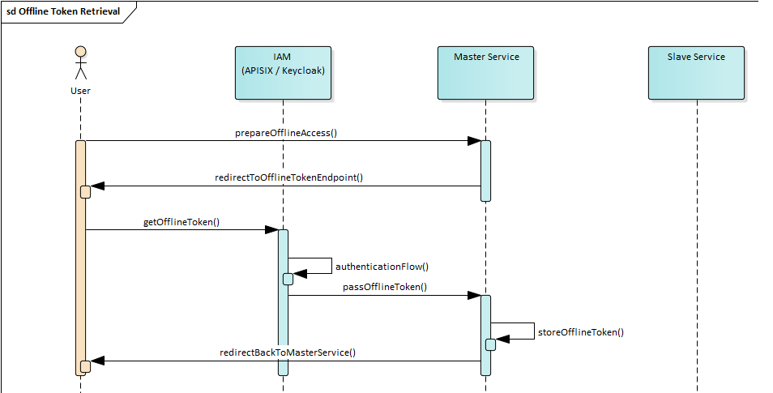
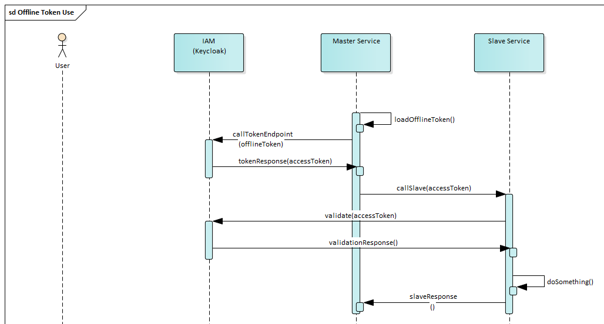

# Delegated Access Approaches

## Introduction

Delegated access is needed in several scenarios in EOEPCA, often
in conjunction with long-lived processes.

### Example

A user may issue a processing request to the Processing BB.
The Processing BB initially queues the request for a while, waiting for
resources to become available. It then executes the processing job,
which may also take a while (hours, days, ...). Finally the Processing BB
delegates to the Workspace BB in order to store the processing result in
the user's workspace.

### Assumptions and Challenges

According to the example above, the following assumptions can be made:

* Both processing and storing the result are done using the requesting
  user's identity. So there is no delegation of rights from one user to
  another or to a dedicated Processing BB account.
* While the processing job is waiting in the queue, no user session
  should be actively kept open.
* Processing may take a while. The processing job should be able to open
  a user session (or create access tokens) as needed, but it should not
  be required to keep it open all the time.
* During processing, the Processing BB may have to access further
  services or resources on the user's behalf.
* The access to the Workspace BB is assumed to be short-lived and to
  fit into a single user session or access token lifetime.
  So the Workspace BB should have no need to manage user sessions
  itself in this scenario.

### Approaches

The main approach discussed in this document is the use of offline
tokens as a means to bridge time gaps and thereby support delegated
access for long-lasting, deferred or repetitive tasks.

Delegated access itself can most easily be accomplished by simply
passing an access token from one service to another. This is a
legitimate approach and is used as the initial solution.

A somewhat more sophisticated approach for delegated access is the
use of token exchange. It is about to become operationally available
in Keycloak in the near future and is considered a useful amendment
for the delegated access scenarios.

## Approach 1: Offline Tokens

The proposed approach for bridging time gaps is the use of offline
tokens.

### General Considerations

#### Characteristics

The main characteristics of offline tokens are:

* Offline tokens are designed to be long-lived and to be persisted
  by the client that obtains them.
* Offline tokens remain valid after a restart of Keycloak
* Offline tokens can be revoked via the Admin console and (if
  configured) via the Account console
* Offline tokens can also be revoked via the revoke token endpoint.
* By default, offline tokens have an unlimited lifetime, but are
  revoked automatically if not used for 30 days.
* Apart from that, offline tokens behave like ordinary refresh tokens.

#### Limitations

The following limitations of offline tokens have been identified:

1. Offline tokens can only be obtained during the authentication process.
   However, this does not necessarily mean that user interaction is required.
2. Like refresh tokens, offline tokens are bound to the client that
   requests them and cannot be used by other clients.
3. Offline tokens have not been designed for delegated access.
   Only the client that requested the offline token is able to use it
   to obtain access tokens (JWT). In order for delegation to work, it
   must be made sure that the scope of the access token is wide enough.
   E.g., its audience should include the whole realm or at least all
   services that may have to be called.

   Furthermore it should be made sure that only the service that
   obtained the offline token actually needs to bridge larger time gaps
   and that all authorization required by each of its individual
   subactivities can be performed within the lifetime of an access token.

Note that the limitations no. 1 and no. 3 are addressed by token
exchange. Thus the use of token exchange may mitigate or even eliminate
them, depending on the detailed arrangement of the token exchange
feature in Keycloak.

#### Recommendations

This leads to the following general recommendations regarding the use
of offline tokens:

* Offline tokens should only be obtained if required. A client should
  hold at most one offline token per user at a time.
* Offline tokens should be kept secret and never be disclosed.
* Offline tokens should only be used by private (confidential) clients.
* If possible, a client should revoke its offline token if it is no
  longer needed, instead of just dropping it.
* Token rotation can be used to mitigate token leakage at the cost of
  some administrative overhead.

#### Further Considerations

Further considerations and evaluation results regarding the use of
offline tokens include:

* The `openid-connect` plugin of APISIX obtains an offline token instead
  of a refresh token if the scope `offline_access` is contained in the
  `scope` parameter.
* The `openid-connect` plugin passes the offline token to the backend in
  the `X-Refresh-Token` header if the `set_refresh_token_header` parameter
  is set to `true`. The offline token contained in the `X-Refresh-Token`
  header can be passed to the token endpoint as a refresh token in order
  to obtain an access token.
* A new offline token is generated upon each login. Therefore it is not
  recommended to simply add the `offline_access` scope globally for a
  complete service. Instead, a dedicated endpoint with a separate subroute
  should be defined for this, and only this endpoint should request the
  `offline_access` scope. The endpoint should only be accessed when a
  new offline token must be obtained. Note that the endpoint may still
  allow an attacker who is able to authenticate as an existing user to
  create lots of useless offline tokens.
* If an access token is obtained through an offline token, this does not
  constitute a session. Thus no session can be found in the Keycloak Admin
  UI in this case. Only the offline token itself is shown as a session.
* No separate refresh token is generated when obtaining an access token
  through an offline token. Instead, the offline token itself (same
  content, but maybe with a new signature) is returned as the refresh
  token. In case of token rotation (token is revoked and replaced when
  it is used), the returned token is a new one, which means that it must
  be stored in place of the original one.

### Obtain and Manage Offline Tokens

This section discusses how a service that needs to retrieve and use offline
tokens should do this.

#### Service Setup

This section describes the proposed way to obtain and manage offline tokens
from a service's (or BB's) perspective:

* Each service that requires offline tokens should provide a dedicated
  endpoint for token retrieval. The route to this endpoint should be
  [configured](https://eoepca.readthedocs.io/projects/iam/en/latest/admin/configuration/apisix/ingress-configuration/#obtaining-an-offline-token)
  to obtain an offline token through the `openid-connect`
  plugin. The backend should read the offline token from the
  `X-Refresh-Token` header, store it and then take appropriate action
  (whatever needs to be done next from the service's perspective) directly
  or through a redirect.
* If the service needs to retrieve an offline token for a user, it should
  notify the user about this (explaining in detail what happens) and ask
  them for confirmation and consent. Then it should redirect the user's
  client to its offline token retrieval endpoint. The service now
  "legally" possesses an offline token, and the user knows about this.
* If the service already possesses an offline token for a user, it can
  check if the token is still valid by creating an access token through it.
  If this fails, the offline token is invalid, and a new offline token
  needs to be retrieved. This usually requires an active user session.
  Therefore the check should be performed when the user is present.

  Creating an access token also refreshes the offline token, so this makes
  sense if the offline token shall be used soon, but has not been used for
  a long time.
* Services should not perform any regular keep-alive activities on offline
  tokens. Offline tokens should only be touched when they are actually
  needed.
* If the offline token endpoint is accessed outside the control of the
  service (e.g., by an attacker who tries to flood Keycloak with offline
  tokens), the service should immediately revoke the generated offline
  token. In case of repeated attempts, the service should generate a
  security alert.
* If the service knows that it does not need the offline token any more,
  it should explicitly revoke it and delete it from its database.
  This may be the case, e.g., if the service is notified that the user
  account has been disabled or if the user explicitly requests deletion
  of their data from the service.
* A service that holds an offline token never passes it to other services,
  because they could not use it anyway. Instead, it requests an access
  token (JWT) and passes it to upstream services, which in turn may pass
  it to their upstream sevices. This implies that there is a master service
  that holds the offline token and may use it to bridge time gaps,
  whereas all other (slave) services only get an access token and are
  therefore not able to bridge time gaps.

#### Offline Token Retrieval

A service that needs to retrieve offline tokens must provide an offline
token retrieval endpoint.

The *simplified* sequence diagram below sketches the process of offline
token retrieval. It is assumed that the user has already interacted with
the master service before and is already authenticated. At some point,
the master service recognizes that an offline token will be required,
notifies the user about this and asks him for confirmation.
This confirmation, represented by the `prepareOfflineAccess` call,
triggers the offline token retrieval.

The user is redirected to the offline token retrieval endpoint (represented
by `getOfflineToken`). This triggers an authentication flow with scope
`offline_access` requested, which may involve interaction with the user's
client (not shown), but usually not with the user himself.
The authentication flow results in an offline token, which is passed to
the master service.

The master service stores the token for later use and then redirects to
another page (e.g. one that tells the user that the offline token was
obtained successfully).

Note that the master service may use other mechanisms than redirection
to access the offline token retrieval endpoint. E.g., a form could be
submitted to the endpoint, and the endpoint itself could present a
confirmation page.

Note that the diagram is simplified (i.e., inaccurate) in the sense that
it omits the user's client, treats the IAM as a single service and neglects
that actually all communication between the user and the master service
passes through APISIX.

#### Offline Token Use

At some point, a service that possesses an offline token may
want to use it for accessing another service.

The following diagram sketches the use of the offline token. The user
is not involved here any more. Instead, the process is initiated by the
master service. It loads the offline token it previously stored and
exchanges it for an access token via Keycloak's token endpoint. It then
calls some action on the slave service with the access token attached.
The slave service validates the token via Keycloak, does something useful
and sends a response to the master service.

## Approach 2: Token Passing

The simplest and traditional way to implement delegated access with
authorization in OAuth is to pass an already existing access token
from the calling (master) service to the called (slave) service.
This means that all services in the call chain effectively rely on
the same access token.

This only works if the initial access token already addresses all
services as its audience that may be invoked directly or indirectly.
So the token must have a broad audience and allows the involved
services to call one another without any restrictions.

E.g., if the user calls service A, which needs to call services B
and C to fulfil the request, the access token's audience must
include A, B and C. However, such a token does not only allow the
user to call A and A to call B and C, but it also allows B to call
A and C and C to call A and B. So e.g. a malicious service C would
be able to call A in order to do evil things.

Hence this approach is not perfect from a security point of
view, but it is easy to implement and usually acceptable if
security demands are moderate. Therefore (and also due to a current
lack of viable alternatives) we use it as the standard approach
for now.

## Approach 3: Token Exchange

Token exchange is a somewhat more sophisticated approach for
delegated access than simple token passing. It allows exchanging
access tokens for tokens of a different type, with different audience
and/or with different scopes. This allows improving security by limiting
the scope of tokens passed to other services. The ability to
obtain tokens of a different type may also be useful for some
EOEPCA scenarios. See [this issue](https://github.com/EOEPCA/iam/issues/85)
for more information.

Token exchange has been around as a preview feature
in Keycloak for a while and is about to become a fully supported
feature in the near future (starting with Keycloak 26.2).
