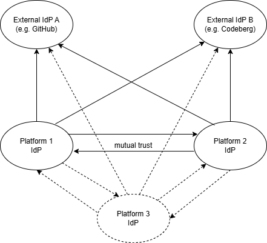
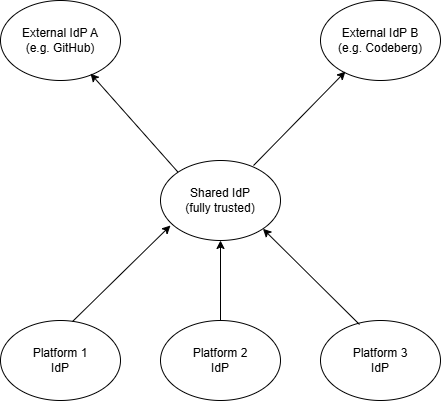
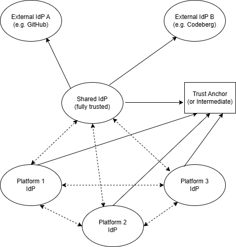

# Federated Delegation

This document summarizes approaches to support federated delegation scenarios,
especially between EOEPCA-based platforms.

## Use Cases

Cross-platform use cases are currently being elaborated in a
separate document, which has not been published yet. This section
only provides a short summary.

See [this document](token-exchange.md) for a description of some
basic use cases that could be extended to support cross-platform
interaction.

Cross-platform delegation is primarily relevant in the context of
processing, for instance:

* Delegation of processing to another platform or to an HPC cluster
* Retrieval of input products from another platform or from an
  external source
* Storing processing results in a user's workspace on another
  platform
* Looking up items (e.g., auxiliary inputs) in an external catalogue

Furthermore, cross-platform delegation may also be useful for further
use cases like: 

* Harvesting or updating external catalogues (Resource Registration BB)
* Delivering notifications to external receivers (Notification &
  Automation BB)
* Monitoring external resources (Resource Health BB)
* Synchronization of users or groups between platforms (IAM BB)

## Candidate technologies

This section describes some technologies and how they may (or may not)
contribute to solving federated delegation scenarios.

### General Challenges

There are some relevant major challenges that arise when extending
intra-platform use cases beyond a single platform:

1. Trust between platforms. If a service on one platform wants to
   call a service on another platform, there must be some kind of
   trust relationship between those platforms.
2. Bridging of time gaps. In case of long-running, asynchronous
   operations, there may be large time gaps between calls to other
   services. E.g., in case of processing, there may be a delay between
   the processing request and actual start of processing, and
   processing itself usually takes a while so that there is a delay
   between retrieving processing inputs and storing the results.
3. Transparent delegation. It should always be clear who (service)
   is acting on behalf of whom (user). This is relevant for
   auditability as well as for ensuring that proper authorization
   is applied everywhere.

Time gaps and delegation are also relevant for intra-platform use
cases, but addressing them becomes much more complex when multiple
platforms are involved.

Note that the challenges stated here are actually a subset of those
faced in conjunction with Agentic AI. Therefore our expectation is
that all necessary technologies and best practices will be developed
in that context, at least in the long term. Unfortunately however,
this development is still ongoing and far away from standardization.
Thus for now we will have to focus on existing technologies that are
supported by Keycloak. A white paper on the challenges and potential
solutions in the context of Agentic AI can be found
[here](https://openid.net/new-whitepaper-tackles-ai-agent-identity-challenges/).

### Token Exchange

Token Exchange allows clients to exchange tokens for tokens with
a different scope, audience or type. These changes may also
imply further modifications to the token, e.g. by adding, removing
or altering claims.

Keycloak has limited support for token exchange. It supports exchanging
access tokens for access tokens with different scope or audience.
It also allows exchanging access tokens for refresh tokens as long
as this does not constitute a new session. In general, token exchange
is only possible within an existing session. 

Note that Keycloak only supports internal-to-internal token exchange.
To obtain internal tokens from external ones as needed in a federated
context, it is necessary to combine token exchange with other
techniques like the JWT Authorization Grant or Federated Client
Authentication.

See [this document](token-exchange.md) for further details about token
exchange and its [limitations](token-exchange.md#support-by-keycloak).

#### Delegation Support

Since version 26.7, Keycloak's has started supporting delegation as
part of the token exchange feature, starting with admin delegation
(allowing an administrator to act as another user).
In Keycloak 26.8, support for client delegation was added. Client
delegation allows a client (i.e., M2M user) to act on behalf of a
user. This may be useful especially for processing use cases.

Unfortunately though, this feature is still in preview state and
not yet officially supported. It is still under development and
not ready for productive use, because details may still change.

Delegation always requires explicit user consent. At present, this
is required for every single login session that involves delegation,
because consent is not stored. This is inconvenient and may be an
obstacle for automation on the user's side.
More details about delegation support in Keycloak and how to
use it can be found
[here](https://www.keycloak.org/securing-apps/token-exchange#_token-exchange-delegation)

Token Exchange Delegation allows merging two identities into a
single token. These identities must be provided as valid tokens.
In case of client delegation, the user identity becomes the subject
of the resulting token (`sub` claim), and the client becomes the
actor (`act` claim). The resulting token thus expresses the user's
identity, but additionally identifies the client as the actual
actor.

### JWT Authorization Grant

The JWT Authorization Grant allows a user on one (source)
platform to authenticate at another (target) platform by
presenting an assertion issued by the source platform.
The grant works non-interactively and is thus suitable
for M2M access. Effectively, it is a way to perform an
external-to-internal token exchange.

A first evaluation of the JWT Evaluation Grant for an
ordinary user (*not* a service account) revealed the
following limitations:

* The grant results in a plain access token. It is not
  possible to obtain a refresh token.
* The grant does intentionally not create a persistent
  session. Therefore it is not possible to exchange the
  access token for a refresh token. Thus an access token
  from a JWT Authorization Grant has the same limitations
  as one obtained from an offline token. See also
  [this issue](https://github.com/keycloak/keycloak/issues/43799).
* "Refreshing" the access token is thus only possible by
  repeating the entire JWT Authorization Flow from the
  source IdP, passing a still valid or new token as the
  assertion.
* Issuing long-lived access tokens is possible, but
  discouraged by the standard ([RFC 7521](https://datatracker.ietf.org/doc/html/rfc7521)).
* Exchanging the access token for another access token,
  e.g. to change audience, is possible.
* For service accounts, there may be additional limitations.
  It might even be impossible to use JWT Authorization Grant for
  service accounts if they cannot be linked to external accounts.
  In this case, Federated Client Authentication may be a possible
  alternative.

The JWT Authorization Grant requires the following prerequisites:

* It must be enabled for the federated IdP (source IdP).
* It must be enabled for the client that performs the authorization.
* The source IdP must be in the client's list of accepted IdPs.
* The client must be confidential.
* The user must previously have established a link between their
  external and their local account.
* The access token used as the assertion must explicitly state
  the target IdP's issuer URL as its audience. The token cannot
  be addressed to a specific client of the target IdP.

The following example shows how the JWT Authorization Grant can
be used, assuming that the environment variable `ACCESS_TOKEN`
contains an access token from the source IdP to use as
the assertion:

```shell
curl -s -S -k https://develop.eoepca.org/iam/auth/realms/eoepca/protocol/openid-connect/token \
    -H 'content-type: application/x-www-form-urlencoded' \
    -d "client_id=example-client" \
    -d "client_secret=example-client-secret" \
    -d "grant_type=urn:ietf:params:oauth:grant-type:jwt-bearer" \
    -d "assertion=${ACCESS_TOKEN}"
```

The response of this request contains the resulting access token.
Note that the JWT Authorization Grant never returns a refresh token.

### Federated Client Authentication

Federated client authentication (available since Keycloak 26.6)
can be used to authenticate as a local client using an assertion
issued by an external IdP.
It is not primarily intended for federated access from one
platform to another. Nonetheless it may be usable for this
purpose in pure M2M scenarios where no real user identity is
involved.

Federated Client Authentication is just an alternative way for
authenticating a client instead of using client ID and secret.
Otherwise it does not differ from client credentials flow.

Three different types of assertions are supported:

* OIDC Access Tokens: A token issued by one IdP is used to
  authenticate as a client at another IdP. This can be used
  for federated access between platforms.
* Kubernetes Service Account: A Kubernetes service account
  token is used to authenticate as a client. This is a way
  to get rid of explicit client secrets in Kubernetes clusters.
  In theory, this could also be used to let a pod on one platform
  authenticate directly as a client on another platform, but
  this would require explicit trust between the target IdP
  and the source Kubernetes cluster.
* SPIFFE JWT SVID: This is a more generic alternative to
  Kubernetes Service Account tokens using a standardized
  form of JWTs issued by a SPIFFE IdP. This is still a
  preview feature (i.e., not officially supported) in
  Keycloak 26.8 and therefore not considered for now.

For federated access between platforms, using OIDC Access
Tokens as assertions should be evaluated further as the
primary approach.

Authenticating clients using Kubernetes Service Accounts
can be useful to reduce the management effort of a cluster,
because it eliminates the need to generate and store client
secrets explicitly. However, this is primarily a matter of
infrastructure. Using this for federated access would be
possible in principle, but should be considered as a misuse
of the feature.

The following example shows how Federated Client
Authentication can be used, assuming that the environment
variable `ACCESS_TOKEN` contains an access token from the
source IdP to use as the assertion. Note that it is not
necessary (but permissible) to specify the `client_id`
parameter, because the client ID can be derived from `sub`
claim of the assertion.

```shell
curl -s -S -k https://develop.eoepca.org/iam/auth/realms/eoepca/protocol/openid-connect/token \
    -H 'content-type: application/x-www-form-urlencoded' \
    -d "client_assertion_type=urn:ietf:params:oauth:client-assertion-type:jwt-bearer" \
    -d "client_assertion=${ACCESS_TOKEN}" \
    -d "grant_type=client_credentials"
```

The response of this request contains the resulting access token.

### Client-Initiated Backchannel Authentication (CIBA)

The CIBA flow allows services (OIDC clients) to ask a user for
asynchronous interactive authentication and confirmation. This
requires the user to register a trusted authentication device
(e.g. a mobile phone) upfront.

By default, Keycloak only supports a dummy authentication channel
for development. For real-world scenarios, a suitable authentication
channel provider must be configured.

CIBA would allow bridging time gaps by allowing clients to request
user authentication at any time. This is normally intended for
interactive scenarios, e.g. a payment process. It is less suitable
for unattended activities like processing, which might request
authentication at any time, even at 2am at night.

Therefore this is not suitable as the primary solution for bridging
time gaps during long-running operations, but it can still be helpful
as a last resort if an operation took longer than expected and
requires new authorization, because the original one has expired.

### OpenID Federation

[OpenID Federation](https://openid.net/specs/openid-federation-1_0.html)
is a standard for interoperability between different trust
domains. It is currently not supported by Keycloak (26.8) and thus
cannot be used yet. There is already an
[issue](https://github.com/keycloak/keycloak/issues/40509) for the
implementation of OpenID Federation, but there has been no noticeable
progress so far.

OpenID Federation allows establishing a dynamic trust topology
without having to create explicit mutual trust relationships
between arbitrary entities (IdPs or SPs). Instead, trust is
realized by so-called trust anchors, which are the root of a
tree of trusted entities.

On the one hand, the trust anchor is trusted by all entities in
the tree. On the other hand, the trust anchor knows about its
direct child entities and can issue signed entity statements that
provide trustable information about them.
Such child entities can be Intermediate Entities which are in turn
able to issue entity statements about their children. Altogether,
this establishes a federation between all entities in the tree,
mediated by the trust anchor and the intermediate entities.

When OpenID Federation is eventually supported by Keycloak, it
would be beneficial to leverage it. It would allow creating a
federation around a set of EOEPCA-based platforms that need to
collaborate. Independently, it would also allow individual
EOEPCA-based platforms to participate in existing OpenID
federations.

### Possible Future Options

This section is a collection of unsorted links to activities that
may lead to improved solutions in the future. For now, these
will not be evaluated.

[OAuth Identity and Authorization Chaining Across Domains](https://datatracker.ietf.org/doc/draft-ietf-oauth-identity-chaining/)

## Federation Structure

This section sketches some approaches to create a federation
between multiple EOEPCA-based platforms.

### Mutual Federation

If only two or at most three platforms are involved, it is an
option to simply establish static mutual trust relationships
between them. This is done by federating the IdPs of all
platforms with one another, such that each IdP accepts
identities provided by all other IdPs.

For two platforms, this leads to two relationships. For three
platforms, six trust relationships would have to be established.
It is obvious that this approach is feasible for two platforms,
but it does not scale at all. The following figure
illustrates this.



If multiple platforms accept identities from a shared set of
external IdPs, this requires individual trust
relationships between each platform and each external IdP.
Furthermore, this may require users to explicitly (manually)
link accounts via multiple paths. Manual linking is necessary,
because external IdPs cannot usually be fully trusted. There
is no absolute guarantee that users on two IdPs that have the
same e-mail address are actually the same person, e.g.,
because one of the IdPs does not verify e-mail addresses
properly or because an e-mail address was reused by another
person.

For two platforms that share an external IdP, an identity
from that IdP can reach each platform directly or via the
other platform. Unless the user always logs in via the same
platform, both the direct and the indirect links may be
required for both platforms, leading to up to four links
altogether. This may still be acceptable, but quickly becomes
inscrutable if more than two platforms are involved.
This can be mitigated by the shared IdP approach described next.

### Shared IdP

A shared IdP that is fully trusted by multiple platforms allows
platforms to collaborate without establishing mutual trust
relationships. Instead, each platform only needs to trust
the shared IdP. External IdPs should be integrated via the
shared IdP and can then be used transparently by all platforms.
The figure below illustrates the idea.



The assumption that the shared IdP can be fully trusted
(especially regarding claims like the e-mail address) allows
automating the linking of user accounts between each platform
and the shared IdP. Whenever a user logs in to a platform for
the first time, a shadow account can be created without user
interaction, because it can be assumed that the shared IdP has
already verified the user's e-mail address and possibly
performed further verification as necessary.

SSO between platforms would also work seamlessly. Each platform
IdP would simply delegate authentication to the shared IdP,
which would use the existing user session if available.

Of course, this approach also has its downsides:

A shared trusted IdP must be operated by an organization that is
trusted by all platform providers. This may be a problem if
platforms are operated by different providers that cannot agree
on a trusted third party. However, as long as platforms are run
in the context of a single organization like ESA, this
organization can take the role of the trusted third party.

For machine-to-machine interaction between platforms, mutual trust
would be helpful, because it allows direct authentication between
the platform. However, the shared IdP approach does intentionally
not provide mutual trust between platforms to maintain scalability.

If a platform wants to authenticate at another platform, it thus
needs a token from the shared IdP. The platform IdP may have stored
the token that it received upon login, but the individual platform
services do not have access to it. Keycloak's Identity Brokering API
may solve this issue, but it complicates the authentication process
and may be a security risk, because it gives services access to
tokens they should normally not possess. So it should be avoided
if possible.

Another imaginable mitigation approach could be to introduce mutual
trust between the shared IdP and each platform. This would possibly
allow platform services to exchange tokens issued by the platform
IdP for tokens issued by the shared IdP, e.g. by using the JWT
Authorization Grant. However, this solution introduces a loop into
the login process and could be a security risk. Furthermore, it
is unclear if it would work at all.

### OpenID Federation

OpenID Federation could help to eliminate most of the shortcomings
of the previous approaches. The following figure shows a variant
of the shared IdP approach that leverages OpenID Federation.
Solid arrows represent explicit trust relationships, whereas dashed
arrows depict implicit trust relationships established through
OpenID Federation.



OpenID Federation introduces an independent trust infrastructure.
In the depicted case, a Trust Anchor serves as a trusted third
party. It is assumed that it is operated by the same organization
as the shared IdP. If the shared IdP itself supports acting as a
Trust Anchor, it may even be the same piece of software.

An Intermediate would be used instead of a Trust Anchor if an existing
external Trust Anchor (e.g., provided by an external federation) shall
be used. This could eliminate the explicit trust relationships
between the shared IdP and the external IdPs.

The depicted approach basically combines the shared IdP approach with
the mutual trust approach. The OpenID Federation infrastructure (Trust
Anchor or Intermediate) adds a bit of complexity, but in turn
eliminates the need to establish mutual trust relationships
explicitly. This makes the approach very flexible and scalable.

E.g., adding another platform would just require two steps:

1. Establish a trust relationship between the platform's IdP and
   the relevant Trust Anchor or Intermediate, i.e., make the
   platform IdP trust the Trust Anchor.
2. Configure the platform IdP as a child entity of the Trust Anchor
   or Intermediate.

The depicted structure is just an example. Other alternative
topologies are also possible depending on the requirements and
context.
E.g., it may be possible to eliminate the shared IdP if all
platforms are integrated into a common existing OpenID
Federation infrastructure. It may also be beneficial to
integrate certain platform services into the topology in order
to allow them to interact directly with other platforms without
having to involve the IdPs of both platforms.

Though Keycloak does not support OpenID Federation yet, it appears
to be a promising option for the future.
