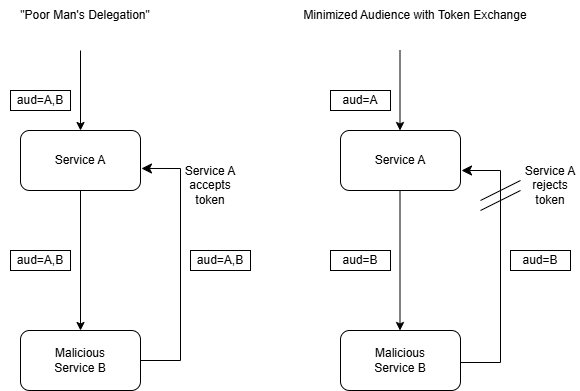

# Token Exchange

This document collects information about Token Exchange (RFC 8693),
its support by Keycloak and potential use cases that can be supported
using Token Exchange or related features.

Keycloak's Legacy Token Exchange feature (V1) is explicitly not taken
into consideration. Only Token Exchange V2 and related features are
considered. The reference Keycloak version is 26.5.6 unless noted
otherwise.

## Token Audience

Controlling the audience of tokens is one of the main applications
of token exchange. It is primarily used to improve security.

### Security Considerations

The audience of a token is mostly relevant for security.
A service should only accept tokens that it has obtained itself
(`azp` set to the requesting client) or that is intended to
be consumed by it (`aud` includes the target client).

Furthermore, tokens that are passed from one service to another
should have minimal audience, so that only the target service
can consume them.

The reason for this is shown in the following figure. It compares
the simple way of passing around a token with full audience (aka
"poor man's delegation") with an approach that uses token exchange
and passes tokens with minimal audience.



Suppose a user calls a rather powerful Service A that internally
uses a less powerful Service B. Now suppose that Service B has
been compromised and intends to misuse Service A.

In case of poor man's delegation, the same token is used
everywhere, and this token allows using both Service A and
Service B. So Service B can easily use the token it receives from
Service A to make malicious calls to Service A. BTW, this setup
would also allow the user to call Service B directly, which
may not be desired either.

In case of the minimum audience approach both is impossible.
Service A receives a token that is only addressed to it and
cannot be used to call Service B. It exchanges this token for
one that addresses only Service B and passes it to Service B.
If Service B tries to use this token to call Service A,
Service A rejects it. An attempt of Service B to exchange
the token for one that is addressed to Service A would be
rejected unless Service B is explicitly granted permission to
obtain tokens with Service A as audience.

So the minimum audience approach effectively prevents malicious
services (ur users) to use services that they are not supposed
to use, thus minimizing potential damage.

### Audience Handling

Each client should be configured to create initial access tokens with
minimal audience (ideally only a single client ID).
Routes should be configured to accept only tokens whose audience includes
the expected client.
The OPA client and route as generated by the IAM-BB Helm chart can be
taken as an example.

Tokens with another audience are typically issued seamlessly via the
Authorization Code Flow (aka Standard Flow) in case of interactive access
(H2M). For non-interactive access (M2M), the caller should request
them explicitly via Token Exchange.

### Observations

* The APISIX `openid-connect` plugin validates the audience if a token is
  presented explicitly via the `Authorization` header.
* The APISIX `openid-connect` plugin does *not* validate the audience of
  a token that it retrieved itself via Authorization Code Flow.
* So in the latter case, it simply passes a token with mismatched audience
  through to the backend and thus does not detect a misconfigured audience
  in the client.
* At least every instance of the `openid-connect` plugin (typically every
  route, maybe unless `PluginConfig` is involved - tbc) retrieves its own
  token. This ensures that only tokens from the configured client are
  passed to the backend. So, if the client is properly configured, the
  audience will be OK.

## Delegation Scenarios

This section describes the delegation scenarios identified for EOEPCA.

### Processing

Processing typically runs asynchronously in a deferred process.
The process of setting up a processing request is thus decoupled
from processing itself.

A processing request is typically set up within an interactive
user session, or it is submitted via an API within a M2M session.
In both cases, the session is typically short-lived, i.e., the
user typically logs out after a while or the API call may have
been made using a short-lived access token.

Hence processing itself cannot take place within the user
session in which the request is created. Instead, it is
triggered internally by the processing system when appropriate
resources become available. The acting party is thus the
processing system, which acts on behalf of the user.

#### Approach using delegation

Delegation would be the natural and most appropriate approach
to handle the processing scenario. During the request submission
process, the User grants permission to the Processing System to
execute the processing request on their behalf. While executing
the processing request, the Processing System uses this
permission to obtain a token that allows it to access external
systems on the user's behalf as needed.

This involves the following steps:

1. The user logs into the Processing System's frontend. During the
   login process (or optionally later in a separate step), the user
   is asked to permit the Processing System to call required
   services on their behalf. This results in an access token with
   the claim `may_act` set to the Processing System's ID. Note that
   the user's consent is stored in Keycloak and need not be
   repeated on every login.
2. The user sets up and submits a processing request, which is
   accompanied by the access token created above. The Processing
   System frontend queues the request incl. the token.
3. Some time later the Processing System backend decides to execute
   the processing request. Using the user's token as the subject
   token and a token representing its own identity as the actor
   token, it requests a new access token from the IdP using
   token exchange. This token expresses that the Processing System
   is acting on behalf of the original user.

Note that Keycloak does not yet support delegation using token
exchange. So the approach sketched above cannot currently be used
with Keycloak.

Note: It is unclear if the access token may be expired when it is
used as a subject token in token exchange. If it cannot be
expired, the approach above may not work reliably, because it
cannot be guaranteed that the access token is still valid or even
that the original user session still exists when processing is
triggered.

#### Approach using offline tokens

A possible viable alternative to the delegation approach described
above would be to use an offline token as the bridge between the
frontend session and background execution of the processing request.

The flow would be quite similar as for the delegation scenario, but
no actual delegation would take place.

1. The user logs into the Processing System's frontend. During the
   login process (or preferably later just before request submission),
   the frontend obtains an offline token for the user.
   So there finally is an initial plain access token and an additional
   offline token, which can be stored with the request. The audience
   of the offline token should be the backend of the Processing System.
   Note that the frontend should store the offline token and reuse it
   for further processing requests if it is still valid long enough.
2. The user sets up and submits a processing request, which is
   accompanied by the *offline* token created above. The Processing
   System frontend queues the request incl. the token.
3. Some time later the Processing System backend decides to execute
   the processing request. Whenever external calls are required
   during processing, the backend obtains an access token from the
   offline token using `refresh_token` grant and optionally exchanges
   it for an access token with proper audience. These access tokens
   do *not* express that the Processing System is acting on behalf of
   the original user, but only bear the original user's identity.
   However, the fact that the Processing System was involved is still
   documented by the `azp` claim.

A possible way to obtain an offline token is described
[here](https://eoepca.readthedocs.io/projects/iam/en/latest/design/approaches/delegated-access/#offline-token-retrieval).
Note that the offline token must be stored and managed by the
frontend. It also needs to be renewed from time to time.
In contrast, in the delegation case, the user's consent would only
have to be requested once and would then be managed by Keycloak. 

Note that offline tokens and access tokens obtained from them cannot
be exchanged for refresh tokens. This means that services called by
the backend are not able to extend the lifetime of their session
beyond the lifetime of the access token they receive. New access
tokens can only be obtained from the original offline token, which
the backend should not disclose.

### Resource Health User Jobs

Resource Health allows users to configure health check jobs that
are executed regularly. These jobs typically execute
user-provided code and are run on the user's behalf. This is very
similar to the Processing use case and basically subject to the
same considerations.

The current implementation uses the offline token approach.
The offline token and the access tokens obtained from it have a
wide audience and can thus be used by the user code to call
arbitrary services that the user has permissions for. The offline
token is managed by Resource Health and never disclosed to
the user code. Instead, the user code only gets a prepared
access token with the same audience as the offline token.

In a way, this makes sense, because Resource Health does not
necessarily know in advance which services the user code will
call. So it cannot reasonably limit the token audience.

A possible security improvement could be to allow the user to
configure the desired audience and scope of the access token
that is passed to the user code. Resource Health could then
provide a suitable, limited-audience and limited-scope access
token using token exchange.

On the long run, it might also make sense to switch to the
delegation approach to mitigate limitations of the offline
token approach or improve the user's comfort. However, on the
one hand, at least access token lifetime limitations are not
really an issue here, because the jobs typically run rather
quickly. On the other hand, the long lifetime of an offline
token is useful for jobs that are run regularly. So there is
probably no urgent need to change the approach, and changing
it might also have its downsides.

### Other Delegation Scenarios

**TODO:** Add further relevant scenarios as needed...

## Internal Token Exchange

### Support by Keycloak

Note: Keycloak's Token Exchange V2 only supports cases that do not require
a new user session or allow activities outside the current user session.
This implies that it does not allow retrieving offline tokens. Furthermore,
only confidential clients may exchange tokens.

Keycloak's Standard Token Exchange generally supports the following
features:

* Scope
  * Reduction
  * Extension (only supported for scopes configured for the calling client)
* Audience
  * Reduction (Dropping audiences also drops their associates roles)
  * Extension (indirectly via scopes)
* Retrieve refresh token for an access token

The following features are *not* supported:

* Impersonation
* Delegation (under development, see
  [this issue](https://github.com/keycloak/keycloak/issues/38279))
* Exchanging an offline token for another token (Note: An access token
  can be obtained using the `refresh_token` grant)
* Exchanging another token for an offline token
* Retrieving a refresh token for an access token obtained from an offline session

### Use Cases

Client A received an access token for User U and needs to call client B
on behalf of User U, maintaining User U's identity. Client A may want to

* reduce audience to a minimum
* change audience from Client A to Client B
* reduce scopes to a minimum
* extend scopes, e.g. if Client B needs additional claims
* retrieve a refresh token
* retrieve an offline token (*not supported!*)

Note: Client A is mentioned as the authorized party in the exchanged token.
So it is apparent to Client B that the token was exchanged by/ issued to
Client A and that Client A is acting on behalf of User U. 

Note: Impersonation (as another "real" user) is probably not
required in the context of EOEPCA+.

Note: Explicit delegation (to another "real" user) is not absolutely
required within a single EOEPCA+ platform, though it would be helpful
in the processing scenario (user delegates to processing system).
It might also be relevant for inter-platform interaction.

### Configuration

For information how to configure clients for token exchange,
please refer to the
[Declarative Keycloak Configuration guide](https://eoepca.readthedocs.io/projects/iam/en/latest/admin/configuration/integration/declarative-keycloak-config/).

### Token Exchange Examples

This section contains some examples for relevant use cases
of token exchange. For more details and examples, please
refer to the related
[Keycloak documentation](https://www.keycloak.org/securing-apps/token-exchange#_standard-token-exchange).

#### Adding and Removing Scopes and Audience

Token Exchange allows adding or removing scopes using the
`scope` parameter of the token exchange request. If the
parameter is unset, the scopes of the original token are
preserved. If the `scope` parameter is set, it determines
the scopes of the target token. The target token will have
exactly the specified scopes plus all default scopes of the
requesting client.

Note that scopes can be configured not to appear in tokens.
Such scopes are not listed in the `scope` claim of the target
token, but their mappers still take effect. E.g., such a
scope may add an audience to the token without becoming
visible itself.

Actually there is no direct way to add audience during
token exchange, but this must be done by adding a scope
with a mapper that adds the desired audience. Thus a
client can only add audience for which a corresponding
scope is assigned to it (as default or optional scope).
The same applies to modifications of other claims:
A client can only perform modifications if there is
an assigned scope with an appropriate mapper.

The `audience` parameter of the token exchange request
is just a filter that limits the audience of the target
token to the given values. This does not only affect the
`aud` claim, but also removes any roles of clients that
are not listed in the `audience` parameter.

The following example demonstrates how scopes and
audiences can be added or removed:

```shell
curl -s -S -k https://develop.eoepca.org/realms/eoepca/protocol/openid-connect/token \
    -H 'content-type: application/x-www-form-urlencoded' \
    -d "client_id=example-client-id" \
    -d "client_secret=example-client-secret" \
    -d "grant_type=urn:ietf:params:oauth:grant-type:token-exchange" \
    -d "subject_token=the_original_access_token" \
    -d "subject_token_type=urn:ietf:params:oauth:token-type:access_token" \
    -d "audience=client_B,client_C" \
    -d "scope=add_client_B"
```

The example request sets the scopes of the target token to
`add_client_B`. This scope is applied to the target
token in addition to the default scopes of the requesting
client, e.g. `profile` or `email`. Any other (optional) scopes
of the original token are dropped.

Let's assume that the scope `add_client_B` has a mapper that
adds the audience `client_B` to the resulting token. Let's also
assume that the original token has an audience of `client_A`.

After applying the scopes, the resulting audience is
`client_A,client_B`, and the intermediate token would
also contain the client roles of these two clients.

Now the `audience` parameter comes into play. It specifies
that only the clients `client_B` and `client_C` may appear
as audience in the target token. This causes `client_A`
and its roles to be removed from the token, whereas
`client_B` and its roles are kept. The audience value
`client_C` does not have an effect, because `client_C`
is not contained in the intermediate token. It does *not*
cause `client_C` to be added to the audience.

So the `aud` claim of the resulting token will only
contain `client_B`. Thus we effectively exchanged a token
that was addressed to `client_A` for one that is
addressed to `client_B`.

#### Obtaining a Refresh Token

If a Service A calls another Service B, it typically only passes
an access token to it. However, if Service B executes a long-lasting
operation that involves calls to another Service C, the lifetime
of the access token may be too short. In such a situation, Service B
may exchange the received access token for a refresh token, which
allows it to generate new access tokens as needed, even after the
initial access token has expired.

The following example demonstrates how to exchange an access token
for a refresh token:
```shell
curl -s -S https://develop.eoepca.org/iam/auth/realms/eoepca/protocol/openid-connect/token \
    -H 'content-type: application/x-www-form-urlencoded' \
    -d "client_id=example-client" \
    -d "client_secret=example-client-secret" \
    -d "grant_type=urn:ietf:params:oauth:grant-type:token-exchange" \
    -d "subject_token=the_original_access_token" \
    -d "subject_token_type=urn:ietf:params:oauth:token-type:access_token" \
    -d "requested_token_type=urn:ietf:params:oauth:token-type:refresh_token"`
```

The response of this request contains the requested refresh token
as well as a new access token.

Note that the request fails if the original access token
(`subject_token`) has been obtained directly or indirectly from
an offline token. It also fails if the requesting client does
not support refresh tokens.

## Internal-to-External Token Exchange

Internal-to-External Token Exchange is not supported by
Keycloak.

The Identity Brokering API can be used to retrieve
the token issued by the federated IdP at which the user
authenticated. If this is useful for inter-platform
federation still needs to be evaluated.

## External-to-Internal Token Exchange

Keycloak does not directly support External-to-Internal Token
Exchange. However, the JWT Authorization Grant allows
users to authenticate against Keycloak using a JWT that
was issued by an external federated IdP. This effectively
exchanges an external for an internal access token and
can thus be used as a "lightweight" replacement for real
external-to-internal token exchange. If the resulting
internal token needs further customization, this can be
achieved using the existing Standard Token Exchange.

This combination is expected to be sufficient for most if
not all relevant inter-platform M2M scenarios if the
platforms involved are federated bidirectionally.
