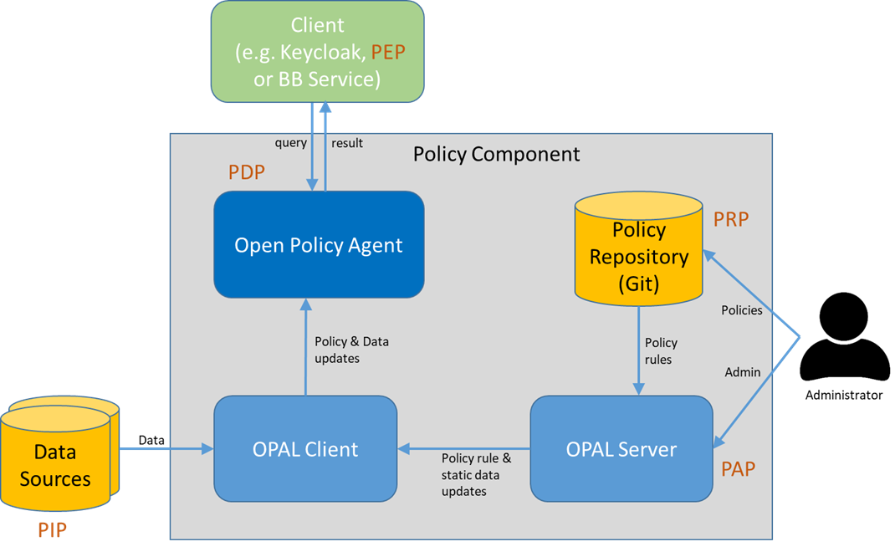

# Policy Component (OPA & OPAL)

The policy component is responsible for taking decisions based on a configured
set of rules. It centralizes rule administration and evaluation in order to
improve maintainability and consistency of policy rules and separate the aspect
of decision making from authorization and enforcement.

The policy component consists of an Open Policy Agent (OPA), which
is embedded into the Open Policy Administration Layer (OPAL).

## Open Policy Agent (OPA)

The policy engine of the IAM BB is an Open Policy Agent (OPA).
Its main role is that of a Policy Decision Point (PDP), but it can also
be used in many other situations where decisions have to be made.

Keycloak connects to the OPA via the Keycloak-OPA adapter plugin, which
allows it to generate policy decisions to OPA. Furthermore, OPA can
be accessed directly by other authorized BBs that require policy
decisions for their own purposes.

## Open Policy Administration Layer (OPAL)

Open Policy Administration Layer (OPAL) is a management layer for OPA.

As shown below, OPAL adds rule management and auditing support via a
Git repository and takes the role of a PAP with Git used as a PRP.
It also manages real-time data replication from arbitrary data sources
(PIPs) into OPA, ensuring that its rule and data caches remain up to date.
Hence it helps integrating OPA into the EOEPCA environment and simplifies
its administration.

## Deployment Structure

This section describes the deployment structure for OPA and OPAL

### Pure OPA

OPA itself consists of a single binary file and can be deployed anywhere
by simply copying that file to the desired destination and running it
with the appropriate command line parameters.

### OPAL

OPAL is a bit more complex. It is typically deployed via a Helm chart.
The deployment consists of three containers/ pods:

* The OPAL Server container runs the OPAL server. There is exactly one
  server per OPAL deployment.
* The OPAL Client container runs the OPAL client. It may additionally
  include an embedded instance of OPA that is managed by that OPAL
  client. An OPAL deployment may include one or more clients.
* The Helm chart additionally deploys a single container running PostgreSQL,
  which is solely used as a message bus for communication between the OPAL
  server and client(s).

### Persistence

OPAL itself (including its embedded OPA) does not require any persistent
volumes. It obtains all required information from the configured external
Policy Repository (Git) and optionally from the configured Data Sources.

Note that this only works reliably if rules and data are fully
managed by OPAL and not manipulated directly via OPA's REST API.
If direct manipulation must be supported, persistence needs to be added
for OPA.

### Known Limitations

The OPAL Helm Chart currently only allows configuring a single listener
for the embedded OPA. Hence it does not allow making OPA listen for HTTP
and HTTPS connections at the same time, though OPA itself supports this.

The OPAL Helm Chart does not provide a means to mount secrets into the
OPAL Client and Server containers. Therefore it is not possible to include
trusted TLS certificates into the container without manipulating the
container image.

If necessary, both limitations can be eliminated by enhancing the OPAL
Helm Chart. For now, however, we chose to accept and work around them.

### Conclusion

For EOEPCA, we initially assume that manipulation of rules and data only
needs to take place through OPAL. We have therefore chosen to enable and
use the embedded OPA and run it without a dedicated persistence.

In case this turns out to be insufficient, persistence can be added later
and/or OPA can be moved to a container of its own. The latter allows
handling and configuring OPA directly and without the limitations imposed
by the OPAL Helm Chart. It is also possible to deploy multiple OPA and
OPAL Client instances with an identical or different set of rules and data
(for scaling or separation).  

## Securing OPA

OPA is included in the OPAL Client container. Its REST API is exposed via
port 8181 by default and allows both reading and manipulating operations.
Thus it has to be ensured that only safe operations can be performed by
ordinary clients, whereas manipulating operations are restricted to OPAL
and maybe other privileged services or users.

### OPA Security Features

There are three combinable ways to secure OPA's API:

1. Transport Layer Security (TLS): OPA has built-in support for TLS. So it
   is possible to install an HTTPS listener in addition to or instead of the
   default HTTP listener. However, as stated above, the OPAL Helm Chart
   imposes some limitations on the use of listeners and certificates that
   make TLS configuration somewhat less comfortable than it should be.
2. Authorization: If authorization is enabled, OPA consults a dedicated
   authorization rule (system.authz.allow) whenever a request to OPA is
   made. The rule is implemented in Rego like any other policy rule.
   It is provided to OPA as part of its initial configuration, so that it
   is available, before the OPAL client pushes further rules into OPA.
3. Authentication: OPA supports two authentication methods.

   * Token-based authentication simply allows the client to present a
     bearer token, which OPA passes to the authorization policy as an input
     parameter. The policy rule may evaluate the token and base its decisions
     on it. The token may be any printable character sequence, and it is
     entirely up to the policy rule to interpret it. For evaluating and
     validating JWTs, OPA provides built-in functions that help to keep
     the rule concise.
   * TLS-based authentication requires all clients to provide a client
     certificate, which OPA validates against a configured CA certificate.
     OPA extracts the presented certificate's subject and passes it to the
     authorization policy rule.

### Initial Security Concept

This section describes the initial security concept for OPA. It is not
optimized for maximum security, but provides a practicable approach that
is for suitable for the demo environment.

#### TLS

TLS is not enabled directly for OPA. This means that all communication
with OPA from within the cluster is currently unsecured. This decision
is based on the assumption that communication within a node is inherently
safe and that communication between nodes is secured by other means.

Communication from outside the cluster uses HTTPS between the client
and the ingress.

#### Authentication

OPA is configured to use token-based authentication. Requests without
a token are accepted, but limited to rule evaluation. This allows other
BBs (if deployed in the same cluster) to send rule evaluation or query
requests to OPA without having to deal with authentication.

#### Authorization

The preconfigured authorization policy rule distinguishes the following
cases:

If the request does not include a token, only rule evaluation and
querying are allowed. Direct evaluation of system rules is rejected.
Allowed operations are:

* GET / (query form)
* POST /v1/query (query form submission)
* GET/POST /v1/data/** (direct policy evaluation via data API)
  * except: GET/POST /v1/data/system/** (system rules)

Requests from the OPAL client (container-internal) come with a special
root token. If this token is present, the policy rule grants full
access to any URI, using any HTTP method.

Requests from outside the cluster have to pass an ingress whose route
requires authentication (and optionally pre-authorization) via Keycloak.
In this case, a JWT is passed to OPA. The policy rule validates the
JWT against Keycloak. If it is valid, it grants the same permissions
an anonymous request from within the cluster would have (see above).
Otherwise, the request is rejected. As a special case, if the JWT
belongs to a privileged user, the policy rule additionally grants full
GET access to any URI (/**).

Note that the demo cluster is configured via a public Git repository.
The root token is also contained in that repository in plain text,
because there is no easy way to exclude it from there. However, the
root token can only be used from within the cluster and so this is not
a significant security issue on a pure test system that does not
contain sensitive information.
