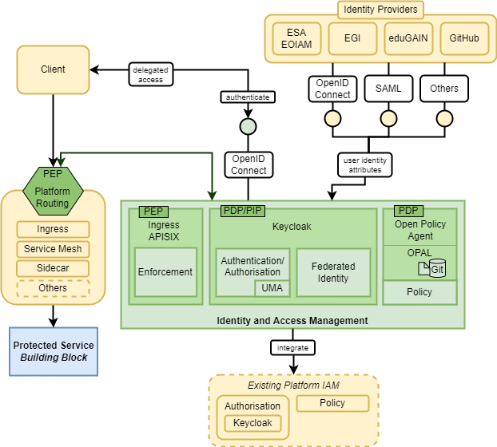

# Architecture Overview

**Note**: This document is work in progress in an early state.
No guarantees are made regarding the consistency and correctness of its contents.

## IAM Building Block Overview

The IAM BB essentially consists of 3 components Keycloak, Open Policy Agent (OPA) and APISIX. 
Keycloak is the core component and is responsible for authentication, authorization and federated identity tasks. 
The Open Policy Agent is used as policy engine, while the APISIX Ingress controller contributes policy enforcement functions. 
From the perspective of the IAM BB, there are several other BBs which relies on its authentication and authorization functions. 
External identity providers can be connected via identity federations and also existing IAM services of utilization domains can be integrated.

The IAM BB acts as a central contact point for authentication and authorization.
For authentication, it provides a central identity provider (IdP) that integrates
with a set of external IdPs and is based on Keycloak.
On the one hand, this allows users to authenticate via an external IdP of their
choice. On the other hand, BBs can simply integrate with the central IdP of the IAM
without having to care about the external IdPs.

Authorization capabilities are also provided by Keycloak through the OIDC protocol
and UMA flow. Simple authorization policies can be configured directly in Keycloak,
whereas more complex policy decisions are delegated to the Open Policy Agent (OPA),
which is also part of the IAM BB. Other BBs may also query the OPA directly in order
to obtain policy decisions without involving the complexity of a UMA flow.

## External Interfaces

### Exposed Interfaces

The IAM BB offers an interface for authentication based on OpenID Connect.
If required, SSO via SAML can also be supported.

Furthermore, the IAM BB supports authorization through the UMA flow and also provides
a REST interface for immediate policy evaluation.

Policies can be managed through a Git repository that is provided by the IAM BB.
However, it has not been decided yet if this Git repository will be exposed to the
outside world or if it will only be available for administrative use.

Protocols:

* OIDC
* SAML (optional)
* UMA
* OPA/ Rego (REST)
* Git (optional)

### Consumed Interfaces

The IAM BB supports delegating authentication to external IdPs via OpenID Connect.
If required, the SAML protocol can also be supported for this purpose.

Furthermore, the IAM BB can be configured to replicate policy-relevant data (e.g.
resource metadata) from arbitrary data sources into the policy engine (OPA).
This replication can take place via HTTP(S) or other protocols.

Protocols:

* OIDC
* SAML (optional)
* external data sources (HTTP(S), other protocols)

## Internal Interfaces

Protocols:

* Git (if not exposed)

## Required Resources

The following components have been foreseen so far:

* Keycloak
* OPAL Client (incl. OPA)
* OPAL Server
* Git
* PostgreSQL
* APISIX
* Keycloak-OPA adapter
