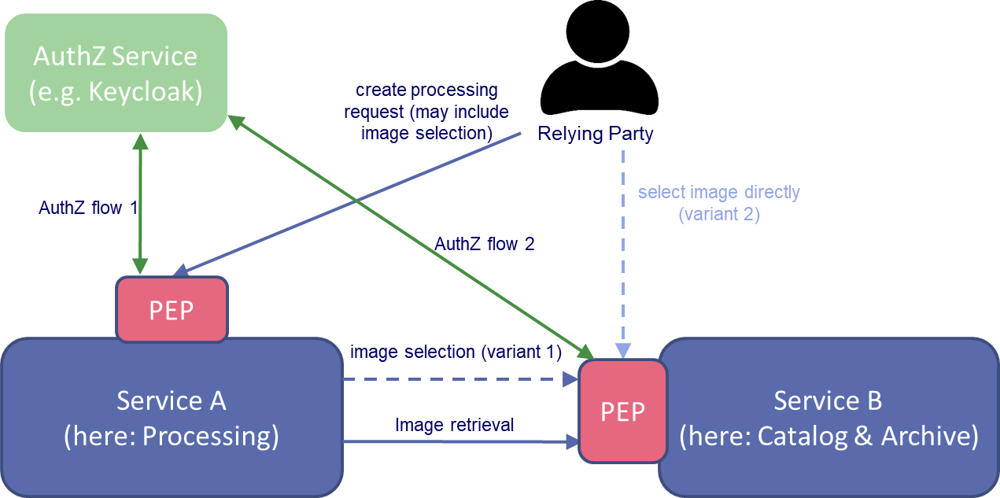

# User Stories

This section lists the known and potentially IAM-related user stories for reference.
This includes user stories defined by the Use Case Definition Document
as well as additional ones that have been identified during the project.

## Original User Stories from the Use Case Definition Document

The Use Case Definition Document lists the following user stories for the IAM use case:

* As a user, I want to authenticate with each platform using the same identity, so that I don't have to maintain multiple identities across many platforms (UC60)
* As an administrator, I want to uniquely identify each user (part of UC61)
* As an administrator, I want to authorise access to the platform resources using policy rules that rely upon the user identity and associated attributes (part of UC61)
* As a user, I want a federated solution to handle user attributes, so that multiple platforms can share these attributes and use them to inform authorisation and service provision decisions (UC62)
* As a user, I want my resources to be accessible only by me and those that I selectively permit (UC63)
* As a user, I want to selectively share my resources with other users/groups (UC64)
* As a user, I want to receive authorised access to resources that have been shared with me (UC65)

The Use Case Definition Document also contains the following user stories for non-IAM use
cases. These user stories may affect the IAM BB, though they are not directly implemented by it.

* As a user, I want a User profile management instance, so that I can manage my personal details. (UC36, User Resource Management)
* As a user, I want group access to User Resource Management capabilities so that I can share them with my team. (UC37, User Resource Management)
* As a user, I want my NoR credits to be applicable across any platform amongst a federated set, so that I can conduct my work on the most appropriate combination of cross-platform services (UC76, Accounting)

## Additional user stories

The following additional IAM-related user stories have been identified so far. 

* As a user, I want to be able to authorize services to access resources on my behalf
* As an administrator, I want to edit and update policy rules in a convenient and traceable way
* As an administrator, I want to ensure that policy decisions are always based on recent information
* As a user, I want new permissions granted to me to take effect without a noticeable delay
* As a user, I want to be able to access new resources after registration without a noticeable delay if I have permission to do so
* As an administrator, I want to ensure that only privileged users can access administrative functionality of the IAM BB

# IAM Use Cases

## Authentication-related Use Cases

### IAM-UC-1: Delegated authentication (UC60, (UC61), UC62)

User stories:

* IAM-US-101 - As a user, I want to authenticate with each platform using the same identity, so that I don't have to maintain multiple identities across many platforms (UC60)
* IAM-US-102 - As an administrator, I want to uniquely identify each user (part of UC61)
* IAM-US-103 - As a user, I want a federated solution to handle user attributes, so that multiple platforms can share these attributes and use them to inform authorisation and service provision decisions (UC62)

The IAM BB must be able to delegate authentication to commonly used external IdPs.
It must also be able to handle identity-related attributes provided by these IdPs,
use them for informing policy decisions and pass them to other BBs as required.

All in all, the IAM BB should ensure that users from any configured sources (IdPs)
are able to use services and resources of any connected BBs as far as access is granted
to them and no technical constraints (e.g. missing required attributes) prohibit this.

## Authorization-related Use Cases

### IAM-UC-2: Delegated authorization

User stories:

* IAM-US-201 - As a user, I want to be able to authorize services to access resources on my behalf (new)

This is especially relevant in the context of processing where the processing
system may need to retrieve a protected input product from the archive on
behalf of the user.

### IAM-UC-3: Resource Sharing (UC63, UC64, UC65)

User stories:

* IAM-US-301 - As a user, I want my resources to be accessible only by me and those that I selectively permit (UC63)
* IAM-US-302 - As a user, I want to selectively share my resources with other users/groups (UC64)
* IAM-US-303 - As a user, I want to receive authorised access to resources that have been shared with me (UC65)

## Miscellaneous Use Cases

### IAM-UC-4: Policy Management (UC61)

User stories:

* IAM-US-401 - As an administrator, I want to authorise access to the platform resources using policy rules that rely upon the user identity and associated attributes (part of UC61)
* IAM-US-402 - As an administrator, I want to edit and update policy rules in a convenient and traceable way (new)

### IAM-UC-5: Update Resource Information

User stories:

* IAM-US-501 - As an administrator, I want to ensure that policy decisions are always based on recent information (new)
* IAM-US-502 - As a user, I want new permissions granted to me to take effect without a noticeable delay (new)
* IAM-US-503 - As a user, I want to be able to access new resources after registration without a noticeable delay if I have permission to do so (new)

Technical prerequisite for resource sharing.
This use case can be generalized to handle further information if required.

### IAM-UC-6: IAM Administrative Access Control

User stories:

* IAM-US-601 - As an administrator, I want to ensure that only privileged users can access administrative functionality of the IAM BB (new)

Security requirement.

# Use Case Elaboration

This section focuses on use cases that may require further elaboration or discussion.

## Ancillary Use Cases

This section collects use cases that presumably need not be supported by the IAM BB
itself, but that may still affect its design.
This includes use cases and features that were supported by the existing IAM solution,
but that are not expected to be required for the new IAM BB. It also includes use
cases that we assume to be out of scope of the IAM BB, but that might still gain some
relevance as the project evolves.

Please note, the following use cases do not yet have a unique identifier. These will be defined in a later phase.

### IAM-UC-7: Direct authentication (NON-use-case)

User stories: (none)

Out of scope of the IAM BB. We assume that authentication is always performed
through external IdPs and that direct authentication against locally stored
user profiles is therefore not relevant, except for testing purposes.

### IAM-UC-8: SCIM support

User stories:

* IAM-US-801 - As a user, I want a federated solution to handle user attributes, so that multiple platforms can share these attributes and use them to inform authorisation and service provision decisions (UC62)

We assume that all relevant user information can be made available through
OIDC during the authentication (SSO) or authorization (UMA) flow.
If this turns out to be insufficient, however, SCIM support may become relevant.
In this case, the um-common-scim-client component from the original EOEPCA project
could be reused if possible.

### IAM-UC-9: User Profile Management (NON-use-case)

User Stories:

* IAM-US-901 - As a user, I want a User profile management instance, so that I can manage my personal details. (UC36)

Out of scope of the IAM BB. We assume that user profile management
functionality is provided by the original IdPs that own the respective
user profiles.

### IAM-UC-10: Update Policy-Relevant Data

User stories: (none)

Possible generalisation of the *Update Resource Information* use case (IAM-UC-5).
It might be necessary or at least desirable to replicate additional information
into OPA.

Generally, any required data can be replicated into OPA as long
as it is not too large and not updated too frequently. As an exception,
user-related information should *never* be replicated into OPA.

### IAM-UC-11: Policy Delegation (probable NON-use-case)

User stories: (none)

This is a use case from the existing um-pdp-engine BB (PDP-UC-005).
Within the new IAM solution, it is foreseen to replace policy delegation with replication
of relevant policy data (e.g. resource metadata) as far as possible.
However, policy delegation may become relevant if policies from the um-pdp-engine
BB are to be reused temporarily without converting them to Rego.

### Unassigned user stories

The following user stories might have an impact on the IAM BB, though they
belong to non-IAM use cases: 

* As a user, I want group access to User Resource Management capabilities so that I can share them with my team. (UC37)

As far as the IAM BB is concerned, we assume that this user story is covered by standard functionality.

* As a user, I want my NoR credits to be applicable across any platform amongst a federated set, so that I can conduct my work on the most appropriate combination of cross-platform services (UC76)

This user story is beyond the scope of the IAM BB, but may require special attention during IAM BB design.
