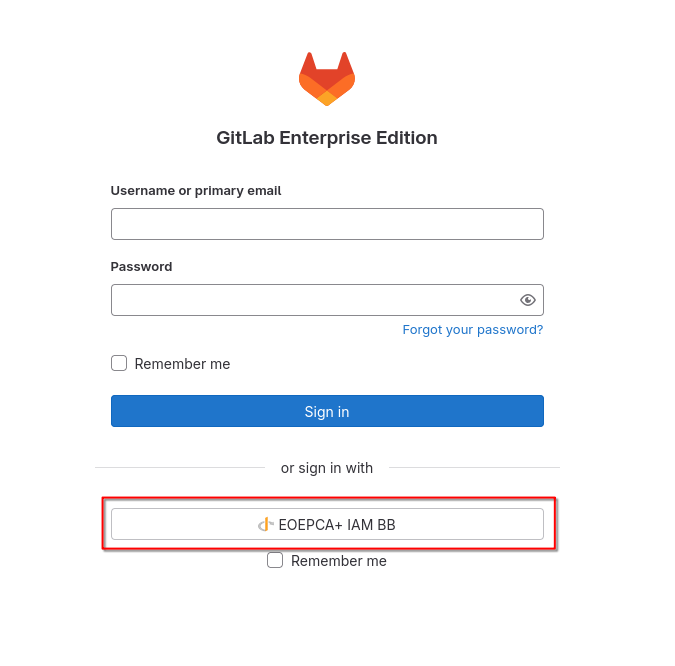
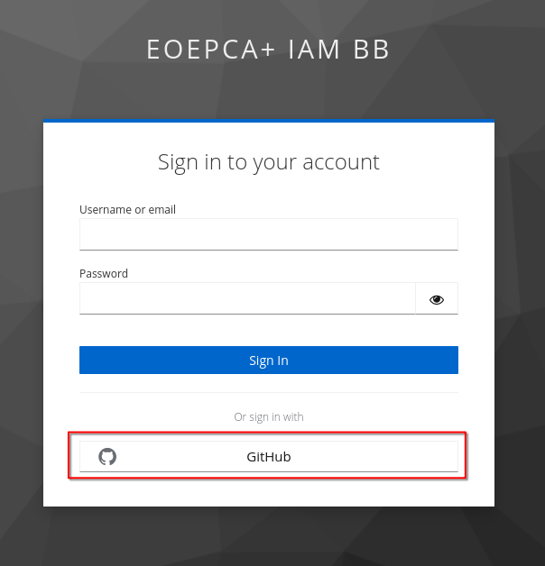
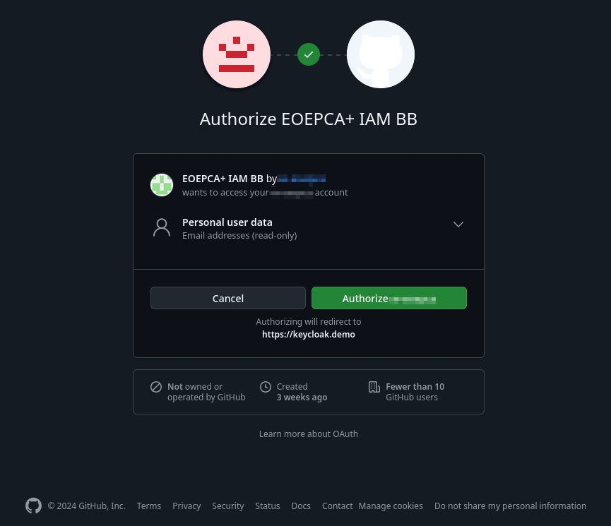
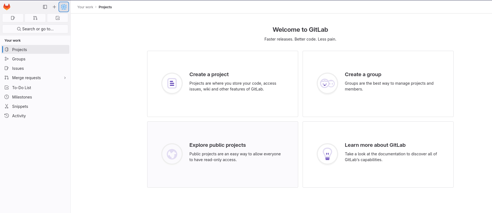

# How to login at the IAM BB

At a fully configured Keycloak with Clients and IDP setup, this is how your login can look like.

## Logging in on your desired application

In this example, it will be GitLab, which we want to be logged in into.

To start the login flow at the IAM BB, press on the **EOEPCA+ IAM BB** Button below of "sign in with".
Please note, that the labels on this and following buttons may differ in your chosen environment.

GitLab should now redirect us to the IAM BB Keycloak application.

## The IAM BB Keycloak application

At the IAM BB Keycloak, we now can choose which account of ours we want to use to login at the GitLab instance.\
The screenshot above shows two possibilities: a login with a local user account from the IAM BB or a login with an GitHub account (IDP currently supported by the IAM BB).

We will use the GitHub Login. After clicking the button, you will be redirect to the offical GitHub site.

## Logging in with your desired account

Arriving at GitHub, you will firstly be asked from GitHub about your credentials, if you are not already logged in there.

After that, GitHub will ask you if you really want to authorize the EOEPCA+ IAM BB to read your GitHub user account details.

**Authorizing this request is important, because your user data at GitHub needs to be transferred over the IAM BB to your desired application you want to login.**\
For the IAM BB and GitHub, this only needs to be done the first time. GitHub will remember your choice and not ask again.

## Logged in at your desired application

After logging in into your user account, you will be redirect back over the IAM BB to your desired application (in this example GitLab) and you will see,
that you are now logged in with your user account!

